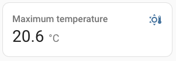

import { Pencil, EllipsisVertical } from 'lucide-react'
import { Separator } from "../../../src/components/ui/separator"

# 统计卡片

<p className="text-xl font-semibold">
统计卡片允许你显示实体的统计值。
</p>

对于支持统计的传感器，系统每5分钟收集一次统计数据。它会保留传感器在特定时期的`最小值`、`最大值`和`平均值`，或者计量实体的`总和`。

如果你的传感器不支持统计功能，请检查以下内容。


<p className='text-center font-extralight'>温度传感器的统计卡片截图。</p>

要将统计卡片添加到你的用户界面：

1. 在屏幕右上角，选择编辑<Pencil className='align-middle inline ' size={18}  />按钮。
    - 如果这是你首次编辑仪表板，会出现**编辑仪表板**对话框。
        - 通过编辑仪表板，你将接管这个仪表板的控制权。
        - 这意味着当新的仪表板元素可用时，它将不再自动更新。
        - 一旦你接管控制权，你将无法让这个特定的仪表板恢复自动更新。不过，你可以创建一个新的默认仪表板。
        - 要继续，在对话框中，选择三点菜单<EllipsisVertical className='align-middle inline' size={18} />，然后选择**接管控制**。

2. [添加卡片并自定义操作和功能](https://www.home-assistant.io/dashboards/cards/#adding-cards-to-your-dashboard)到你的仪表板。

此卡片的所有选项都可以通过用户界面进行配置，但如果你想要更多的时间段选项，你将需要在`yaml`中定义它们。


<div className="bg-white p-6 rounded-2xl border border-[rgba(0,0,0,0.12)] mb-4">
#### 配置变量  
    <div>
        <p className="m-0 pb-2" style={{margin:'0'}}> type <span className="text-xs text-red-400">字符串 必填</span></p>
        <p className="text-sm text-gray-400 m-0" style={{margin:'0'}}>`statistic`</p>
        <Separator className="my-4" />
    </div>

    <div>
        <p className="m-0 pb-2" style={{margin:'0'}}> entity <span className="text-xs text-red-400">字符串 必填</span></p>
        <p className="text-sm text-gray-400 m-0" style={{margin:'0'}}>具有统计功能的传感器的实体ID，或外部统计ID</p>
        <Separator className="my-4" />
    </div>

    <div>
        <p className="m-0 pb-2" style={{margin:'0'}}> stat_type <span className="text-xs text-red-400">字符串 必填</span></p>
        <p className="text-sm text-gray-400 m-0" style={{margin:'0'}}>要渲染的统计类型。`min`（最小值）, `max`（最大值）, `mean`（平均值）, `change`（变化值）</p>
        <Separator className="my-4" />
    </div>

    <div>
        <p className="m-0 pb-2" style={{margin:'0'}}> name <span className="text-xs text-gray-400">字符串 (可选，默认：实体名称)</span></p>
        <p className="text-sm text-gray-400 m-0" style={{margin:'0'}}>实体名称。</p>
        <Separator className="my-4" />
    </div>

    <div>
        <p className="m-0 pb-2" style={{margin:'0'}}> icon <span className="text-xs text-gray-400">字符串 (可选)</span></p>
        <p className="text-sm text-gray-400 m-0" style={{margin:'0'}}>覆盖图标。</p>
        <Separator className="my-4" />
    </div>

    <div>
        <p className="m-0 pb-2" style={{margin:'0'}}> unit <span className="text-xs text-gray-400">字符串 (可选)</span></p>
        <p className="text-sm text-gray-400 m-0" style={{margin:'0'}}>给数据的测量单位。</p>
        <p className="text-sm text-gray-400 m-0" style={{margin:'0'}}>默认：实体提供的测量单位。</p>

        <Separator className="my-4" />
    </div>

    <div>
        <p className="m-0 pb-2" style={{margin:'0'}}> period <span className="text-xs text-red-400">映射 必填</span></p>
        <p className="text-sm text-gray-400 m-0" style={{margin:'0'}}>用于计算的时间段。[见下文](https://www.home-assistant.io/dashboards/statistic/#options-for-period)。</p>
        <Separator className="my-4" />
    </div>

    <div>
        <p className="m-0 pb-2" style={{margin:'0'}}> theme <span className="text-xs text-gray-400">字符串 (可选)</span></p>
        <p className="text-sm text-gray-400 m-0" style={{margin:'0'}}>使用任何已加载的主题覆盖此卡片的主题。有关主题的更多信息，请参阅[前端文档](https://www.home-assistant.io/integrations/frontend/)。</p>
        <Separator className="my-4" />
    </div>

    <div>
        <p className="m-0 pb-2" style={{margin:'0'}}> footer <span className="text-xs text-gray-400">映射 (可选)</span></p>
        <p className="text-sm text-gray-400 m-0" style={{margin:'0'}}>要渲染的底部小部件。参见[页脚文档](/docs/documentation/dashboards/header-footer)。</p>
        <Separator className="my-4" />
    </div>

    <div>
        <p className="m-0 pb-2" style={{margin:'0'}}> collection_key <span className="text-xs text-gray-400">字符串 (可选)</span></p>
        <p className="text-sm text-gray-400 m-0" style={{margin:'0'}}>如果使用时间段：`energy_date_selection`，你可以设置一个自定义键来匹配`energy-date-selection`卡片的可选键。这通常不是必需的，但如果在同一视图上使用多个日期选择卡片，则可能很有用。参见[能源文档](https://www.home-assistant.io/dashboards/energy/#using-multiple-collections)。</p>
        {/* <Separator className="my-4" /> */}
    </div>
</div>

## 示例

或者，可以使用YAML配置卡片：

```yaml
type: statistic
entity: sensor.energy_consumption
period:
  calendar:
    period: month
stat_type: change
```

## 时间段选项

可以通过4种不同的方式配置时间段：

### 日历

使用带有当前周期偏移的固定周期。


<div className="bg-white p-6 rounded-2xl border border-[rgba(0,0,0,0.12)] mb-4">
#### 配置变量  
    <div>
        <p className="m-0 pb-2" style={{margin:'0'}}> period <span className="text-xs text-red-400">字符串 必填</span></p>
        <p className="text-sm text-gray-400 m-0" style={{margin:'0'}}>要使用的周期。`day`（日）, `week`（周）, `month`（月）, `year`（年）</p>
        <Separator className="my-4" />
    </div>

    <div>
        <p className="m-0 pb-2" style={{margin:'0'}}> offset <span className="text-xs text-gray-400">整数 (可选)</span></p>
        <p className="text-sm text-gray-400 m-0" style={{margin:'0'}}>当前周期的偏移量，0表示当前周期，-1表示上一个周期。</p>
        {/* <Separator className="my-4" /> */}
    </div>
</div>

示例，上个月的能源消耗变化：

```yaml
type: statistic
entity: sensor.energy_consumption
period:
  calendar:
    period: month
    offset: -1
stat_type: change
```

### 固定时间段
指定一个固定的时间段，开始和结束是可选的。

<div className="bg-white p-6 rounded-2xl border border-[rgba(0,0,0,0.12)] mb-4">
#### 配置变量  
    <div>
        <p className="m-0 pb-2" style={{margin:'0'}}> start <span className="text-xs text-gray-400">字符串 (可选)</span></p>
        <p className="text-sm text-gray-400 m-0" style={{margin:'0'}}>时间段的开始</p>
        <Separator className="my-4" />
    </div>

    <div>
        <p className="m-0 pb-2" style={{margin:'0'}}> end <span className="text-xs text-gray-400">字符串 (可选)</span></p>
        <p className="text-sm text-gray-400 m-0" style={{margin:'0'}}>时间段的结束。</p>
        {/* <Separator className="my-4" /> */}
    </div>
</div>

示例，2022年的变化：

```yaml
type: statistic
entity: sensor.energy_consumption
period:
  fixed_period:
    start: 2022-01-01
    end: 2022-12-31
stat_type: change
```

示例，不指定开始或结束的所有时间变化：

```yaml
type: statistic
entity: sensor.energy_consumption
period:
  fixed_period:
stat_type: change
```

### 滚动窗口

<div className="bg-white p-6 rounded-2xl border border-[rgba(0,0,0,0.12)] mb-4">
#### 配置变量  
    <div>
        <p className="m-0 pb-2" style={{margin:'0'}}> duration <span className="text-xs text-red-400">映射 必填</span></p>
        <p className="text-sm text-gray-400 m-0" style={{margin:'0'}}>时间段的持续时间</p>
        <Separator className="my-4" />
    </div>

    <div>
        <p className="m-0 pb-2" style={{margin:'0'}}> offset <span className="text-xs text-gray-400">映射 (可选)</span></p>
        <p className="text-sm text-gray-400 m-0" style={{margin:'0'}}>当前时间的偏移量，0表示当前时间段，-1表示上一个时间段。</p>
        {/* <Separator className="my-4" /> */}
    </div>
</div>

示例，1小时10分钟5秒的时间段，结束于现在之前的2小时20分钟10秒：

```yaml
type: statistic
entity: sensor.energy_consumption
period:
  rolling_window:
    duration:
      hours: 1
      minutes: 10
      seconds: 5
    offset:
      hours: -2
      minutes: -20
      seconds: -10
stat_type: change
```

### 动态日期选择

当放置在有能源日期选择卡片的视图上时，统计卡片可以链接显示从日期选择卡片上选择的时间段的数据。

日期选择器时间段的示例：

```yaml
type: statistic
entity: sensor.energy_consumption
period: energy_date_selection
stat_type: change
```

## 相关主题
- [主题](https://www.home-assistant.io/integrations/frontend/)
- [仪表板卡片](https://www.home-assistant.io/dashboards/cards/)

