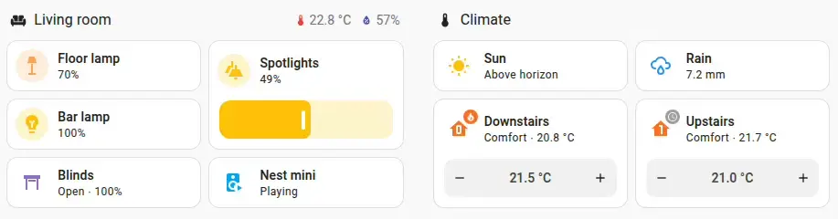

import { Pencil, EllipsisVertical } from 'lucide-react'
import { Separator } from "../../../src/components/ui/separator"

# 磁贴卡片

<p className="text-xl font-semibold">
磁贴卡片让你可以快速查看实体概览。该卡片允许你添加点击操作和控制实体的功能。你还可以选择实体以打开更多信息对话框。对于某些实体，如[气候](https://www.home-assistant.io/integrations/climate)或[人员](https://www.home-assistant.io/integrations/person)实体，会显示一个徽章。
</p>


<p className='text-center font-extralight'>图标后面的圆形背景表示有点击操作。"楼下"和"楼上"气候实体有一个徽章和一个底部对齐的功能。</p>

要将磁贴卡片添加到你的用户界面：

1. 在屏幕右上角，选择编辑<Pencil className='align-middle inline ' size={18}  />按钮。
    - 如果这是你首次编辑仪表板，会出现**编辑仪表板**对话框。
        - 通过编辑仪表板，你将接管这个仪表板的控制权。
        - 这意味着当新的仪表板元素可用时，它将不再自动更新。
        - 一旦你接管控制权，你将无法让这个特定的仪表板恢复自动更新。不过，你可以创建一个新的默认仪表板。
        - 要继续，在对话框中，选择三点菜单<EllipsisVertical className='align-middle inline' size={18} />，然后选择**接管控制**。

2. [添加卡片并自定义操作和功能](https://www.home-assistant.io/dashboards/cards/#adding-cards-to-your-dashboard)到你的仪表板。

<div className="bg-white p-6 rounded-2xl border border-[rgba(0,0,0,0.12)] mb-4">
#### 配置变量  
    <div>
        <p className="m-0 pb-2" style={{margin:'0'}}> type <span className="text-xs text-red-400">字符串 必填</span></p>
        <p className="text-sm text-gray-400 m-0" style={{margin:'0'}}>`title`</p>
        <Separator className="my-4" />
    </div>

    <div>
        <p className="m-0 pb-2" style={{margin:'0'}}> entity <span className="text-xs text-red-400">字符串 必填</span></p>
        <p className="text-sm text-gray-400 m-0" style={{margin:'0'}}>实体ID。</p>
        <Separator className="my-4" />
    </div>

    <div>
        <p className="m-0 pb-2" style={{margin:'0'}}> name <span className="text-xs text-gray-400">字符串 (可选，默认：实体名称)</span></p>
        <p className="text-sm text-gray-400 m-0" style={{margin:'0'}}>覆盖实体名称。</p>
        <Separator className="my-4" />
    </div>

    <div>
        <p className="m-0 pb-2" style={{margin:'0'}}> icon <span className="text-xs text-gray-400">字符串 (可选)</span></p>
        <p className="text-sm text-gray-400 m-0" style={{margin:'0'}}>覆盖实体图标。</p>
        <Separator className="my-4" />
    </div>

    <div>
        <p className="m-0 pb-2" style={{margin:'0'}}> color <span className="text-xs text-gray-400">字符串 (可选，默认：state)</span></p>
        <p className="text-sm text-gray-400 m-0" style={{margin:'0'}}>设置实体激活时的颜色。默认情况下，颜色基于实体的`state`、`domain`和`device_class`。它接受[颜色令牌](https://www.home-assistant.io/dashboards/tile/#available-colors)或十六进制颜色代码。</p>
        <Separator className="my-4" />
    </div>

    <div>
        <p className="m-0 pb-2" style={{margin:'0'}}> show_entity_picture <span className="text-xs text-gray-400">布尔值 (可选，默认：false)</span></p>
        <p className="text-sm text-gray-400 m-0" style={{margin:'0'}}>如果你的实体有图片，它将替换图标。</p>
        <Separator className="my-4" />
    </div>

    <div>
        <p className="m-0 pb-2" style={{margin:'0'}}> vertical <span className="text-xs text-gray-400">boolean (可选，默认：false)</span></p>
        <p className="text-sm text-gray-400 m-0" style={{margin:'0'}}>在名称和状态上方显示图标。</p>
        <Separator className="my-4" />
    </div>

    <div>
        <p className="m-0 pb-2" style={{margin:'0'}}> hide_state <span className="text-xs text-gray-400">boolean (可选，默认：false)</span></p>
        <p className="text-sm text-gray-400 m-0" style={{margin:'0'}}>隐藏实体状态。</p>
        <Separator className="my-4" />
    </div>

    <div>
        <p className="m-0 pb-2" style={{margin:'0'}}> state_content <span className="text-xs text-gray-400">string | list (可选)</span></p>
        <p className="text-sm text-gray-400 m-0" style={{margin:'0'}}>要显示的状态内容。可以是`state`、`last_changed`、`last_updated`或实体的任何属性。可以是包含单个项目的字符串，也可以是字符串项目列表。默认值取决于实体域。</p>
        <Separator className="my-4" />
    </div>

    <div>
        <p className="m-0 pb-2" style={{margin:'0'}}>tap_action <span className="text-xs text-gray-400">map (可选)</span></p>
        <p className="text-sm text-gray-400 m-0" style={{margin:'0'}}>点击卡片时执行的操作。参见[操作文档](https://www.home-assistant.io/dashboards/actions/#tap-action)。默认情况下，它将显示"更多信息"对话框。</p>
        <Separator className="my-4" />
    </div>

    <div>
        <p className="m-0 pb-2" style={{margin:'0'}}>hold_action <span className="text-xs text-gray-400">map  (可选)</span></p>
        <p className="text-sm text-gray-400 m-0" style={{margin:'0'}}>点击并按住时执行的操作。参见[操作文档](https://www.home-assistant.io/dashboards/actions/#hold-action)。</p>
        <Separator className="my-4" />
    </div>

    <div>
        <p className="m-0 pb-2" style={{margin:'0'}}>double_tap_action <span className="text-xs text-gray-400">map  (可选)</span></p>
        <p className="text-sm text-gray-400 m-0" style={{margin:'0'}}>双击时执行的操作。参见[操作文档](https://www.home-assistant.io/dashboards/actions/#hold-action)。</p>
         <Separator className="my-4" />
    </div>

    <div>
        <p className="m-0 pb-2" style={{margin:'0'}}>icon_hold_action <span className="text-xs text-gray-400">map (可选)</span></p>
        <p className="text-sm text-gray-400 m-0" style={{margin:'0'}}>点击并按住图标时执行的操作。参见[操作文档](https://www.home-assistant.io/dashboards/actions/#tap-action)。</p>
        <Separator className="my-4" />
    </div>

    <div>
        <p className="m-0 pb-2" style={{margin:'0'}}>icon_hold_action <span className="text-xs text-gray-400">map  (可选)</span></p>
        <p className="text-sm text-gray-400 m-0" style={{margin:'0'}}>点击并按住图标时执行的操作。参见[操作文档](https://www.home-assistant.io/dashboards/actions/#hold-action)。</p>
         <Separator className="my-4" />
    </div>

    <div>
        <p className="m-0 pb-2" style={{margin:'0'}}>icon_double_tap_action <span className="text-xs text-gray-400">map  (可选)</span></p>
        <p className="text-sm text-gray-400 m-0" style={{margin:'0'}}>双击图标时执行的操作。参见[操作文档](https://www.home-assistant.io/dashboards/actions/#hold-action)。</p>
        <Separator className="my-4" />
    </div>

    <div>
        <p className="m-0 pb-2" style={{margin:'0'}}> features <span className="text-xs text-gray-400">list (可选)</span></p>
        <p className="text-sm text-gray-400 m-0" style={{margin:'0'}}>控制实体的附加小部件。参见[可用功能](https://www.home-assistant.io/dashboards/features)。仅支持气候相关功能。</p>
        <Separator className="my-4" />
    </div>

    <div>
        <p className="m-0 pb-2" style={{margin:'0'}}> features_position <span className="text-xs text-gray-400">string (可选，默认：bottom)</span></p>
        <p className="text-sm text-gray-400 m-0" style={{margin:'0'}}>磁贴卡片上功能的位置。可以是`bottom`（底部）或`inline`（内联）。当选项设置为`inline`时，只会显示第一个功能。`inline`与`vertical`选项不兼容。</p>
        {/* <Separator className="my-4" /> */}
    </div>
</div>

## 示例 
或者，可以使用YAML配置卡片：

```yaml
type: tile
entity: cover.kitchen_window
```

```yaml
type: tile
entity: light.bedroom
icon: mdi:lamp
color: yellow
```

```yaml
type: tile
entity: person.anne_therese
show_entity_picture: true
```

```yaml
type: tile
entity: person.anne_therese
vertical: true
hide_state: true
```

```yaml
type: tile
entity: light.living_room
state_content:
  - state
  - brightness
  - last-changed
```

```yaml
type: tile
entity: vacuum.ground_floor
features:
  - type: vacuum-commands
    commands:
      - start_pause
      - return_home
```

## 可用颜色 
想要给磁贴卡片上色？选择以下颜色之一：`primary`（主要）、`accent`（强调）、`disabled`（禁用）、`red`（红色）、`pink`（粉色）、`purple`（紫色）、`deep-purple`（深紫色）、`indigo`（靛蓝色）、`blue`（蓝色）、`light-blue`（浅蓝色）、`cyan`（青色）、`teal`（蓝绿色）、`green`（绿色）、`light-green`（浅绿色）、`lime`（酸橙色）、`yellow`（黄色）、`amber`（琥珀色）、`orange`（橙色）、`deep-orange`（深橙色）、`brown`（棕色）、`grey`（灰色）、`blue-grey`（蓝灰色）、`black`（黑色）和`white`（白色）。

## 相关主题
- [卡片操作](/docs/documentation/dashboards/actions)
- [卡片功能](/docs/documentation/dashboards/features)
- [仪表板卡片](https://www.home-assistant.io/dashboards/cards/)