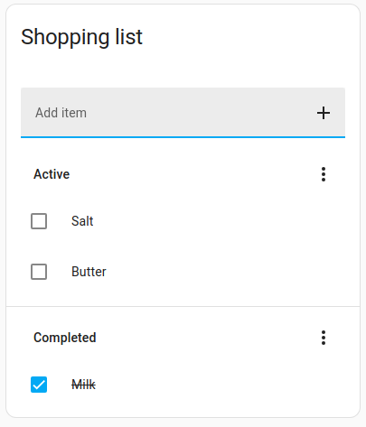
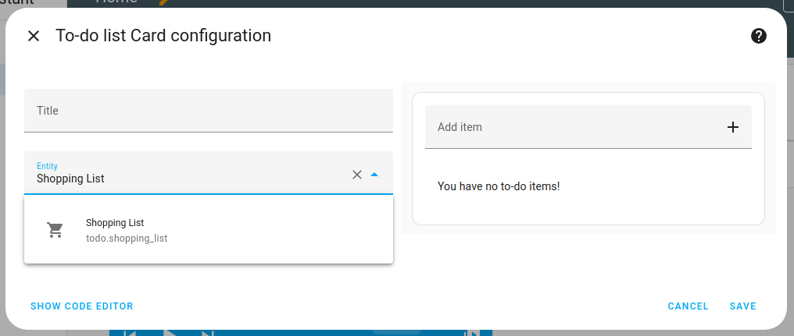

import { Separator } from "../../../src/components/ui/separator"


# 待办事项列表卡片

<p className="text-xl font-semibold">
待办事项列表卡片允许你添加、编辑、勾选和清除待办事项列表中的项目。
</p>


<p className='text-center font-extralight'>待办事项列表卡片的截图。</p>

## 添加待办事项列表卡片 

1. [使用添加卡片按钮添加卡片](https://www.home-assistant.io/dashboards/cards/#adding-cards-to-your-dashboard)。
    - 在**按卡片**对话框中，选择**待办事项列表**卡片。

2. 在**实体**下拉菜单中，选择你的列表类型。
    - 如果这是你第一次使用待办事项列表，菜单中只有**购物清单**。
    - 这来自默认安装的[购物清单集成](https://www.home-assistant.io/integrations/shopping_list/)。
    - 这与**待办事项列表**仪表板（通过侧边栏访问）上的**购物清单**相同。
    

3. 待办事项列表卡片可以显示来自不同[待办事项列表](https://www.home-assistant.io/integrations/#to-do-list)集成的列表，例如**Bring**!或**Todoist**。
    - 如果你没有看到所需的待办事项列表实体，你需要先添加其集成。
    - 添加待办事项列表集成后，这些列表也可在待办事项列表仪表板上使用。


## YAML 配置 
此卡片的所有选项都可以通过用户界面进行配置。

当你使用YAML模式或只是更喜欢在UI中的代码编辑器中使用YAML时，以下YAML选项可用。


<div className="bg-white p-6 rounded-2xl border border-[rgba(0,0,0,0.12)] mb-4">
#### 配置变量  
    <div>
        <p className="m-0 pb-2" style={{margin:'0'}}> type <span className="text-xs text-red-400">string 必填</span></p>
        <p className="text-sm text-gray-400 m-0" style={{margin:'0'}}>`todo-list`</p>
        <Separator className="my-4" />
    </div>

    <div>
        <p className="m-0 pb-2" style={{margin:'0'}}> entity <span className="text-xs text-red-400">string 必填</span></p>
        <p className="text-sm text-gray-400 m-0" style={{margin:'0'}}>要显示的待办事项实体</p>
        <Separator className="my-4" />
    </div>

    <div>
        <p className="m-0 pb-2" style={{margin:'0'}}> title <span className="text-xs text-gray-400">string (可选)</span></p>
        <p className="text-sm text-gray-400 m-0" style={{margin:'0'}}>待办事项列表的标题。</p>
        <Separator className="my-4" />
    </div>

    <div>
        <p className="m-0 pb-2" style={{margin:'0'}}> theme <span className="text-xs text-gray-400">string (可选)</span></p>
        <p className="text-sm text-gray-400 m-0" style={{margin:'0'}}>使用任何已加载的主题覆盖此卡片的主题。有关主题的更多信息，请参阅[前端文档](https://www.home-assistant.io/integrations/frontend/)。</p>
        <Separator className="my-4" />
    </div>

    <div>
        <p className="m-0 pb-2" style={{margin:'0'}}> hide_completed <span className="text-xs text-gray-400">boolean (可选，默认：false)</span></p>
        <p className="text-sm text-gray-400 m-0" style={{margin:'0'}}>在卡片中隐藏已完成项目部分。</p>
        <Separator className="my-4" />
    </div>

    <div>
        <p className="m-0 pb-2" style={{margin:'0'}}> hide_create <span className="text-xs text-gray-400">boolean (可选，默认：false)</span></p>
        <p className="text-sm text-gray-400 m-0" style={{margin:'0'}}>隐藏卡片顶部用于创建新任务的文本框。</p>
        <Separator className="my-4" />
    </div>

    <div>
        <p className="m-0 pb-2" style={{margin:'0'}}> display_order <span className="text-xs text-gray-400">string (可选，默认：none)</span></p>
        <p className="text-sm text-gray-400 m-0" style={{margin:'0'}}>可选择对待办事项列表的项目进行排序以便显示。选项包括：`none`：按原始顺序显示列表。`alpha_asc`：按字母顺序对列表进行排序。`alpha_desc`：按字母倒序对列表进行排序。`duedate_asc`：按到期日期排序（最早的先显示）。`duedate_desc`：按逆向到期日期排序（最早的最后显示）。</p>
        {/* <Separator className="my-4" /> */}
    </div>
</div>

## 示例 
标题示例：

```yaml
type: todo-list
entity: todo.todo_list
title: Todo List
```

## 相关主题
- [仪表板](https://www.home-assistant.io/dashboards/dashboards/)
- [主题](https://www.home-assistant.io/integrations/frontend/)
- [仪表板卡片](https://www.home-assistant.io/dashboards/cards/)
- [待办事项列表集成列表](https://www.home-assistant.io/integrations/#to-do-list)
- [本地待办事项集成](https://www.home-assistant.io/integrations/local_todo/)
