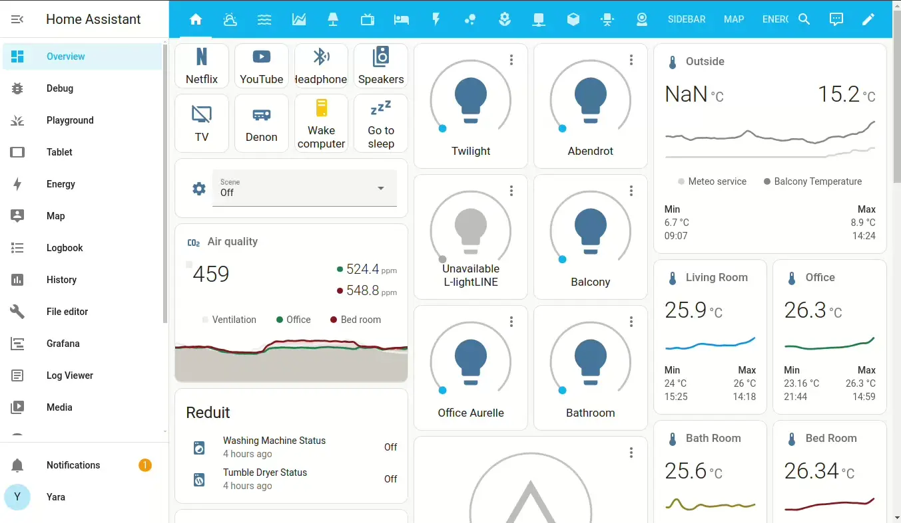
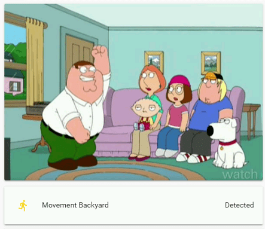
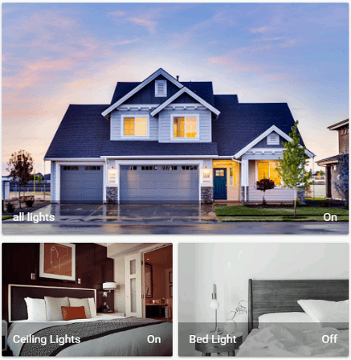

import { Pencil, EllipsisVertical } from 'lucide-react'
import { Separator } from "../../../src/components/ui/separator"

# 垂直堆叠卡片

<p className="text-xl font-semibold">
垂直堆叠卡片允许你将多个卡片组合在一起，使它们始终位于同一列中。
</p>



<p className='text-center font-extralight'>展示如何编辑仪表板和自定义垂直堆叠卡片的屏幕录像。</p>

要将垂直堆叠卡片添加到你的用户界面：

1. 在屏幕右上角，选择编辑<Pencil className='align-middle inline ' size={18}  />按钮。
    - 如果这是你首次编辑仪表板，会出现**编辑仪表板**对话框。
        - 通过编辑仪表板，你将接管这个仪表板的控制权。
        - 这意味着当新的仪表板元素可用时，它将不再自动更新。
        - 一旦你接管控制权，你将无法让这个特定的仪表板恢复自动更新。不过，你可以创建一个新的默认仪表板。
        - 要继续，在对话框中，选择三点菜单<EllipsisVertical className='align-middle inline' size={18} />，然后选择**接管控制**。

2. [添加卡片并自定义操作和功能](https://www.home-assistant.io/dashboards/cards/#adding-cards-to-your-dashboard)到你的仪表板。

## YAML 配置 
当你使用YAML模式或只是更喜欢在UI中的代码编辑器中使用YAML时，以下YAML选项可用。


<div className="bg-white p-6 rounded-2xl border border-[rgba(0,0,0,0.12)] mb-4">
#### 配置变量  
    <div>
        <p className="m-0 pb-2" style={{margin:'0'}}> type <span className="text-xs text-red-400">string 必填</span></p>
        <p className="text-sm text-gray-400 m-0" style={{margin:'0'}}>`vertical-stack`</p>
        <Separator className="my-4" />
    </div>

    <div>
        <p className="m-0 pb-2" style={{margin:'0'}}> title <span className="text-xs text-gray-400">string (可选)</span></p>
        <p className="text-sm text-gray-400 m-0" style={{margin:'0'}}>堆叠的标题。</p>
        <Separator className="my-4" />
    </div>

    <div>
        <p className="m-0 pb-2" style={{margin:'0'}}> cards <span className="text-xs text-red-400">list 必填</span></p>
        <p className="text-sm text-gray-400 m-0" style={{margin:'0'}}>卡片列表。</p>
        {/* <Separator className="my-4" /> */}
    </div>
</div>

### 示例 
基本示例：

```yaml
type: vertical-stack
title: Backyard
cards:
  - type: picture-entity
    entity: camera.demo_camera
    show_info: false
  - type: entities
    entities:
      - binary_sensor.movement_backyard
```


<p className='text-center font-extralight'>堆叠中的图片和实体卡片。</p>

垂直和水平堆叠卡片的组合：

```yaml
type: vertical-stack
cards:
  - type: picture-entity
    entity: group.all_lights
    image:  /local/house.png
  - type: horizontal-stack
    cards:
      - type: picture-entity
        entity: light.ceiling_lights
        image: /local/bed_1.png
      - type: picture-entity
        entity: light.bed_light
        image: /local/bed_2.png
```

<p className='text-center font-extralight'>使用垂直和水平堆叠创建网格布局。</p>

## 相关主题
- [仪表板卡片](https://www.home-assistant.io/dashboards/cards/)