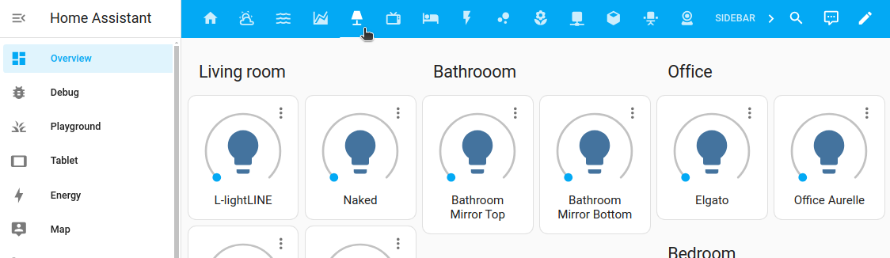
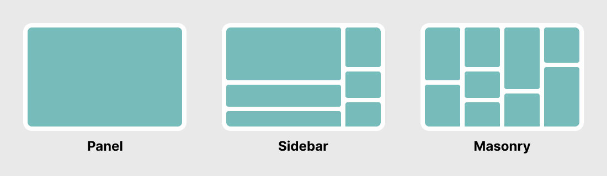
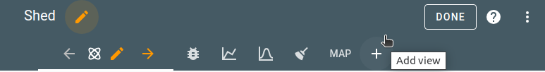
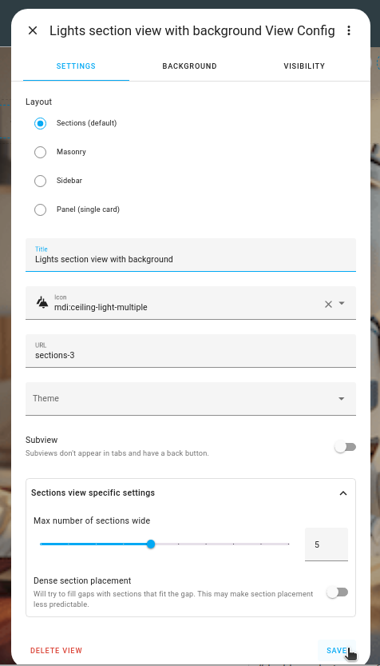
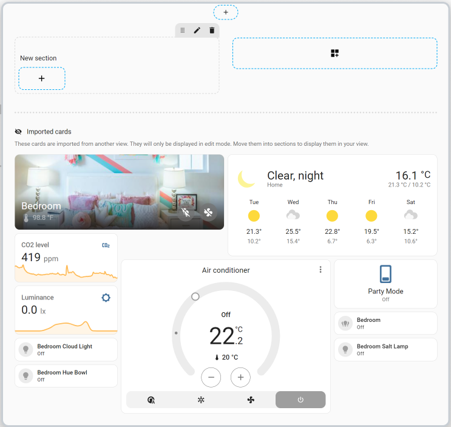

# 视图

import { Separator } from "../../../src/components/ui/separator"

<p className="font-semibold text-xl">
视图是仪表板内的一个选项卡。例如，下面的截图显示了概览仪表板中一个单独的灯光视图。
</p>


<p className="text-center font-extralight">概览仪表板上的灯光视图选项卡</p>

视图控制布局。


<p className="text-center font-extralight">三种基本视图布局：面板、侧边栏和瀑布流</p>

有四种不同的视图类型：

- **分区（默认）**：在网格系统中排列卡片，让你可以将它们分组到不同区块。
- **瀑布流**：根据卡片大小将卡片排列在列中。
- **面板**：以全宽显示一张卡片。例如地图或图像。
- **侧边栏**：将卡片排列在2列中，一个宽列和右侧的一个较小列。

## 向仪表板添加视图

1. 要向仪表板添加视图，在右上角选择铅笔图标。

2. 在顶部菜单栏中选择 `+` 按钮。
    
3. 定义视图设置：

    - 如果你想要视图标题，输入**标题**。
    - 如果你想看到图标，选择[视图图标](/docs/documentation/dashboards/views#视图图标)。
        - 如果定义了图标，则只显示图标。文本仅作为工具提示显示。
        - 我们使用[Material图标](https://pictogrammers.com/library/mdi/)。
    - 如果你想链接到另一个视图，定义[URL](/docs/documentation/dashboards/views#视图的url)。
    - 如果你想使用先前定义的主题，选择[主题](https://www.home-assistant.io/integrations/frontend/#themes)。
    - 选择视图类型。
    - 如果此视图仅用作[子视图](/docs/documentation/dashboards/views#子视图)，启用**子视图**开关。
    - 如果你使用的是**分区视图**，选择你要使用的列数，如果你想让系统填充卡片之间的空隙，启用**密集分区放置**。

    

4. 要使用背景图像，在**背景**选项卡上，选择图像并自定义背景设置。[阅读更多关于这些选项的信息](/docs/documentation/dashboards/views#背景)。

5. 在**徽章**选项卡上，选择你希望以徽章形式表示的实体。
    - 侧边栏和面板视图不支持徽章。

6. 默认情况下，新分区对所有用户可见。在**可见性**选项卡上，你可以为用户禁用视图。

## 将视图迁移到分区视图

如果你已经定义了一个视图，但现在希望将其放在分区视图类型中，你可以迁移该内容。例如，你可以从瀑布流迁移到分区视图。目前，你不能将分区视图类型迁移到另一种视图类型。

迁移不会影响当前视图。它将保持原样，并创建一个新的额外视图。

要将视图迁移到分区视图类型，请按照以下步骤操作：

1. 打开你要迁移的视图，并进入编辑模式。

2. 在配置对话框中，选择新的视图类型。

3. 如果新视图类型提供额外设置，定义这些设置。
    - 有关这些设置的更多信息，请参阅该视图类型的文档。

4. 在右上角，选择**转换**。
    - **结果**：创建了一个新的额外视图。
    - 你当前的视图将保持不变。
    - 一个新的选项卡打开，所有卡片都导入到新视图中。

5. 在**导入的卡片**部分，选择每张卡片，并将它们拖到各个分区中。
    - 要编辑和自定义视图，请按照[分区视图](/docs/documentation/dashboards/sections)文档中的步骤操作。
        

6. 要保存更改，选择**完成**。
    - **结果**：显示你的新仪表板。
    - 如果你有尚未整合的卡片，你仍然可以稍后添加它们。它们仍然在编辑模式下的**导入的卡片**部分中可用。

## 视图的URL

当使用支持导航（`navigation_path`）的卡片时，你可以从一个视图中的卡片链接到另一个视图。这里提供的字符串将附加到字符串`/lovelace/`后面，以创建到视图的路径。不要在路径中使用特殊字符。不要以数字开始路径。这将导致解析器将你的路径读取为视图索引。

### 示例

视图配置：

```yaml
- title: Living room
  # 最终路径是 /lovelace/living_room
  path: living_room
```

图片卡片配置：

```yaml
- type: picture
  image: /local/living_room.png
  tap_action:
    action: navigate
    navigation_path: /lovelace/living_room
```

## 视图图标

如果你定义了视图图标，将显示图标而不是标题，标题将作为工具提示使用。

### 示例

```yaml
- title: Garden
  icon: mdi:flower
```

## 可见性

你可以指定整个视图的可见性或按用户指定。（注意：这仅用于显示选项卡。URL路径仍然可以访问）

### 示例

```yaml
views:
  - title: Ian
    visible:
      - user: 581fca7fdc014b8b894519cc531f9a04
    cards:
      ...
  - title: Chelsea
    visible:
      - user: 6e690cc4e40242d2ab14cf38f1882ee6
    cards:
      ...
  - title: Admin
    visible: db34e025e5c84b70968f6530823b117f
    cards:
      ...
```

### 可见对象的选项

如果将 `visible` 定义为对象而不是布尔值，以指定显示视图选项卡的条件：


<div className="bg-white p-6 rounded-2xl border border-[rgba(0,0,0,0.12)] mb-4">
#### 配置变量  
    <div>
        <p className="m-0 pb-2" style={{margin:'0'}}>user <span className="text-xs text-red-400">string 必填</span></p>
        <p className="text-sm text-gray-400 m-0" style={{margin:'0'}}>可以看到视图选项卡的用户ID（在用户配置页面上找到的唯一十六进制值）。</p>
        {/* <Separator className="my-4" /> */}
    </div>
</div>

## 在YAML中更改视图类型

你可以通过使用不同的视图类型在YAML中更改视图的布局。默认值是 [`section`](https://www.home-assistant.io/dashboards/section)。

### 示例

```yaml
- title: Map
  type: panel
  cards:
    - type: map
      entities:
        - device_tracker.demo_paulus
        - zone.home
```

## 主题

为视图及其卡片设置单独的[主题](https://www.home-assistant.io/integrations/frontend/#themes)。

### 示例

```yaml
- title: Home
  theme: happy
```

## 背景

视图的背景设置可以自定义以显示背景。或者，可以使用主题变量来自定义所有视图的背景。

### 视图特定的背景设置

**图像** - 设置在视图后面使用的背景图像：

- **上传图片**让你从用于显示Home Assistant UI的系统中选择图像。
- **本地路径**让你选择存储在Home Assistant上的图像。例如：`/homeassistant/images/lights_view_background_image.jpg`。
- 要在Home Assistant上存储图像，你需要[配置文件访问](https://www.home-assistant.io/common-tasks/os/#configuring-access-to-files)，例如通过[Samba](https://www.home-assistant.io/common-tasks/os/#installing-and-using-the-samba-add-on)或[Studio Code Server](https://www.home-assistant.io/common-tasks/os/#installing-and-using-the-visual-studio-code-vsc-add-on)附加组件。
- **网络URL**让你从网络上选择图像。例如 `https://www.home-assistant.io/images/frontpage/assist_wake_word.png`。

<div className="bg-white p-6 rounded-2xl border border-[rgba(0,0,0,0.12)] mb-4">
#### 配置变量  
    <div>
        <p className="m-0 pb-2" style={{margin:'0'}}>background <span className="text-xs text-gray-400">map (可选)</span></p>
        <p className="text-sm text-gray-400 m-0" style={{margin:'0'}}>使用图像、透明度、大小、对齐方式、重复和附着选项自定义视图的背景。</p>
    </div>

    <div className="pl-10">
        <p className="m-0 pb-2" style={{margin:'0'}}>image <span className="text-xs text-gray-400">string (可选)</span></p>
        <p className="text-sm text-gray-400 m-0" style={{margin:'0'}}>设置在视图后面使用的背景图像。</p>
        <Separator className="my-4" />
    </div>

    <div className="pl-10">
        <p className="m-0 pb-2" style={{margin:'0'}}>opacity <span className="text-xs text-gray-400">integer (可选，默认：100)</span></p>
        <p className="text-sm text-gray-400 m-0" style={{margin:'0'}}>调整背景的不透明度，从完全不透明到透明。</p>
        <Separator className="my-4" />
    </div>

    <div className="pl-10">
        <p className="m-0 pb-2" style={{margin:'0'}}>size <span className="text-xs text-gray-400">string (可选，默认：auto)</span></p>
        <p className="text-sm text-gray-400 m-0" style={{margin:'0'}}>选择背景如何适应空间。默认为原始图片大小，填充视图（在YAML中为`cover`）会填充视图，必要时进行裁剪，适应视图（在YAML中为`contain`）会将图像适应视图内，保持宽高比。</p>
        <Separator className="my-4" />
    </div>

    <div className="pl-10">
        <p className="m-0 pb-2" style={{margin:'0'}}>alignment <span className="text-xs text-gray-400">string (可选，默认：center)</span></p>
        <p className="text-sm text-gray-400 m-0" style={{margin:'0'}}>精确定位背景。有效选项可以是左上角到右下角之间的任何位置，默认为中心。</p>
        <Separator className="my-4" />
    </div>

    <div className="pl-10">
        <p className="m-0 pb-2" style={{margin:'0'}}>repeat <span className="text-xs text-gray-400">string (可选，默认：no-repeat)</span></p>
        <p className="text-sm text-gray-400 m-0" style={{margin:'0'}}>控制背景是否在视图中重复。当使用平铺背景时，重复很有用。</p>
        <Separator className="my-4" />
    </div>

    <div className="pl-10">
        <p className="m-0 pb-2" style={{margin:'0'}}>attachment <span className="text-xs text-gray-400">string (可选，默认：scroll)</span></p>
        <p className="text-sm text-gray-400 m-0" style={{margin:'0'}}>控制背景图像的位置是固定在视图中，还是滚动。</p>
    </div>
</div>

### 示例

```yaml
# Example configuration.yaml entry
frontend:
  themes:
    example:
      lovelace-background: center / cover no-repeat url("/local/background.png") fixed
```

## 子视图

"视图"可以标记为"子视图"。子视图不会显示在侧边栏顶部的导航栏中。子视图可以，例如，用于显示详细信息；你可以从一个只有基本信息的干净外观的页面链接到这个子视图（通过使用[支持 `navigate` 操作的卡片](/docs/documentation/dashboards/actions)）。想想一个带有几个恒温器的视图和一个带有加热/冷却设备状态信息的子视图。

在子视图上，导航栏只显示子视图的名称和一个返回按钮（不显示图标）。默认情况下，点击返回按钮将导航到前一个视图，但可以设置自定义返回路径（`back_path`）。

你可以通过使用[支持 `navigate` 操作的卡片](/docs/documentation/dashboards/actions)从仪表板的其他部分访问子视图。

### 示例

简单子视图：

```yaml
- title: Map
  subview: true
```

带有自定义返回路径的子视图：

```yaml
- title: Map
  subview: true
  back_path: /lovelace/home
```


<div className="bg-white p-6 rounded-2xl border border-[rgba(0,0,0,0.12)] mb-4">
#### 配置变量  
    <div>
        <p className="m-0 pb-2" style={{margin:'0'}}>views <span className="text-xs text-red-400">list 必填</span></p>
        <p className="text-sm text-gray-400 m-0" style={{margin:'0'}}>视图配置列表。</p>
    </div>

    <div className="pl-10">
        <p className="m-0 pb-2" style={{margin:'0'}}>type <span className="text-xs text-gray-400">string (可选，默认：masonry)</span></p>
        <p className="text-sm text-gray-400 m-0" style={{margin:'0'}}>视图的类型。</p>
        <Separator className="my-4" />
    </div>

    <div className="pl-10">
        <p className="m-0 pb-2" style={{margin:'0'}}>title <span className="text-xs text-red-400">string 必填</span></p>
        <p className="text-sm text-gray-400 m-0" style={{margin:'0'}}>标题或名称。</p>
        <Separator className="my-4" />
    </div>

    <div className="pl-10">
        <p className="m-0 pb-2" style={{margin:'0'}}>badges <span className="text-xs text-gray-400">list (可选)</span></p>
        <p className="text-sm text-gray-400 m-0" style={{margin:'0'}}> 要显示为徽章的实体`ID`或徽章对象列表。请注意，当视图处于面板模式时，徽章不会显示。</p>
        <Separator className="my-4" />
    </div>

    <div className="pl-10">
        <p className="m-0 pb-2" style={{margin:'0'}}>cards <span className="text-xs text-gray-400">list (可选)</span></p>
        <p className="text-sm text-gray-400 m-0" style={{margin:'0'}}>在此视图中显示的卡片。</p>
        <Separator className="my-4" />
    </div>

    <div className="pl-10">
        <p className="m-0 pb-2" style={{margin:'0'}}>path <span className="text-xs text-gray-400">string (可选，默认：视图索引)</span></p>
        <p className="text-sm text-gray-400 m-0" style={{margin:'0'}}>路径用于URL中。</p>
        <Separator className="my-4" />
    </div>

    <div className="pl-10">
        <p className="m-0 pb-2" style={{margin:'0'}}>icon <span className="text-xs text-gray-400">string (可选)</span></p>
        <p className="text-sm text-gray-400 m-0" style={{margin:'0'}}>Material Design Icons中的图标名称。你可以使用[Material Design Icons](https://pictogrammers.com/library/mdi/)中的任何图标。在图标名称前加上`mdi:`，例如`mdi:home`。仅适用于"视图"，不适用于"子视图"。</p>
        <Separator className="my-4" />
    </div>

    <div className="pl-10">
        <p className="m-0 pb-2" style={{margin:'0'}}> background <span className="text-xs text-gray-400">map (可选)</span></p>
        <p className="text-sm text-gray-400 m-0" style={{margin:'0'}}>设置视图后面的背景样式。</p>
        <Separator className="my-4" />
    </div>

    <div className="pl-10">
        <p className="m-0 pb-2" style={{margin:'0'}}>theme <span className="text-xs text-gray-400">string (可选)</span></p>
        <p className="text-sm text-gray-400 m-0" style={{margin:'0'}}>主题视图和卡片。</p>
        <Separator className="my-4" />
    </div>

    <div className="pl-10">
        <p className="m-0 pb-2" style={{margin:'0'}}> visible <span className="text-xs text-gray-400">boolean | list (可选，默认：true)</span></p>
        <p className="text-sm text-gray-400 m-0" style={{margin:'0'}}>对所有用户隐藏/显示视图选项卡，或单个`visible`对象列表。</p>
        <Separator className="my-4" />
    </div>

    <div className="pl-10">
        <p className="m-0 pb-2" style={{margin:'0'}}> subview <span className="text-xs text-gray-400">boolean (可选，默认：false)</span></p>
        <p className="text-sm text-gray-400 m-0" style={{margin:'0'}}>将视图标记为"子视图"。</p>
        <Separator className="my-4" />
    </div>

    <div className="pl-10">
        <p className="m-0 pb-2" style={{margin:'0'}}> back_path <span className="text-xs text-gray-400">string (可选)</span></p>
        <p className="text-sm text-gray-400 m-0" style={{margin:'0'}}>仅适用于"子视图"。点击返回按钮时导航的路径。</p>
    </div>
</div>

### 示例

视图配置：

```yaml
- title: Living room
  badges:
    - device_tracker.demo_paulus
    - entity: light.ceiling_lights
      name: Ceiling Lights
      icon: mdi:bulb
    - entity: switch.decorative_lights
      image: /local/lights.png
```

子视图配置：

```yaml
- title: "Energieprijzen"
  path: "energieprijzen"
  subview: true
  back_path: "/ui-data/climate"

  cards:
    - type: entities
      entities:
        - sensor.today_avg_price
```

## 相关主题
- [瀑布流视图](/docs/documentation/dashboards/masonry)
- [面板视图](/docs/documentation/dashboards/panel)
- [侧边栏视图](/docs/documentation/dashboards/sidebar)
- [分区视图](/docs/documentation/dashboards/sections)
- [关于仪表板](/docs/documentation/dashboards/)
- [向视图添加卡片](/docs/documentation/dashboards/cards#添加卡片到你的仪表板)
- [配置文件访问](https://www.home-assistant.io/common-tasks/os/#configuring-access-to-files)
