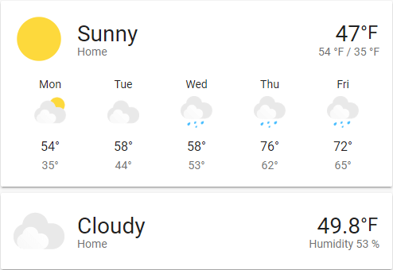

import { Pencil, EllipsisVertical } from 'lucide-react'
import { Separator } from "../../../src/components/ui/separator"

# 天气预报卡片

<p className="text-xl font-semibold">
天气预报卡片显示天气信息。这个卡片在壁挂式显示器上特别有用。
</p>



<p className='text-center font-extralight'>天气卡片的截图。</p>

要将天气预报卡片添加到你的用户界面：

1. 在屏幕右上角，选择编辑<Pencil className='align-middle inline ' size={18}  />按钮。
    - 如果这是你首次编辑仪表板，会出现**编辑仪表板**对话框。
        - 通过编辑仪表板，你将接管这个仪表板的控制权。
        - 这意味着当新的仪表板元素可用时，它将不再自动更新。
        - 一旦你接管控制权，你将无法让这个特定的仪表板恢复自动更新。不过，你可以创建一个新的默认仪表板。
        - 要继续，在对话框中，选择三点菜单<EllipsisVertical className='align-middle inline' size={18} />，然后选择**接管控制**。

2. [添加卡片并自定义操作和功能](https://www.home-assistant.io/dashboards/cards/#adding-cards-to-your-dashboard)到你的仪表板。


## 卡片设置


<div className="bg-white p-6 rounded-2xl border border-[rgba(0,0,0,0.12)] mb-4">
    <div>
        <p className="m-0 pb-2" style={{margin:'0'}}> Entity </p>
        <p className="text-sm text-gray-400 m-0" style={{margin:'0'}}>要使用的`weather`平台的实体。</p>
        <Separator className="my-4" />
    </div>

    <div>
        <p className="m-0 pb-2" style={{margin:'0'}}> Name </p>
        <p className="text-sm text-gray-400 m-0" style={{margin:'0'}}>天气平台所在位置的名称。如果未设置，名称将是天气实体上设置的名称</p>
        <Separator className="my-4" />
    </div>

    <div>
        <p className="m-0 pb-2" style={{margin:'0'}}> Show Forecast </p>
        <p className="text-sm text-gray-400 m-0" style={{margin:'0'}}>如果你想在当前天气下显示即将到来的预报，请勾选此项。</p>
        <Separator className="my-4" />
    </div>

    <div>
        <p className="m-0 pb-2" style={{margin:'0'}}> Forecast type </p>
        <p className="text-sm text-gray-400 m-0" style={{margin:'0'}}>在"每日"、"每小时"和"每日两次"之间选择要显示的预报。</p>
        <Separator className="my-4" />
    </div>

    <div>
        <p className="m-0 pb-2" style={{margin:'0'}}> Secondary Info Attribute </p>
        <p className="text-sm text-gray-400 m-0" style={{margin:'0'}}>在这里你可以指定要在当前温度下显示的次要属性。例如：极值、降水量、湿度。如果未设置，如果有极值（高/低）数据则默认显示极值，如果没有极值数据则显示降水量，如果没有降水量数据则显示湿度。</p>
        <Separator className="my-4" />
    </div>

    <div>
        <p className="m-0 pb-2" style={{margin:'0'}}> Theme </p>
        <p className="text-sm text-gray-400 m-0" style={{margin:'0'}}>用于此卡片的任何已加载主题的名称。有关主题的更多信息，请参阅[前端文档](https://www.home-assistant.io/integrations/frontend/)。</p>
        <Separator className="my-4" />
    </div>

</div>

:::tip
此卡片仅适用于定义了`weather`实体的平台。例如，它适用于[OpenWeatherMap](https://www.home-assistant.io/integrations/openweathermap/#weather)，但不适用于[OpenWeatherMap传感器](https://www.home-assistant.io/integrations/openweathermap/#sensor)
:::

## YAML配置
当你使用YAML模式或只是更喜欢在UI中的代码编辑器中使用YAML时，以下YAML选项可用。


<div className="bg-white p-6 rounded-2xl border border-[rgba(0,0,0,0.12)] mb-4">
#### 配置变量  
    <div>
        <p className="m-0 pb-2" style={{margin:'0'}}> type <span className="text-xs text-red-400">string 必填</span></p>
        <p className="text-sm text-gray-400 m-0" style={{margin:'0'}}>`weather-forecast`</p>
        <Separator className="my-4" />
    </div>

    <div>
        <p className="m-0 pb-2" style={{margin:'0'}}> entity <span className="text-xs text-red-400">string 必填</span></p>
        <p className="text-sm text-gray-400 m-0" style={{margin:'0'}}>`weather`域的实体ID。</p>
        <Separator className="my-4" />
    </div>

    <div>
        <p className="m-0 pb-2" style={{margin:'0'}}> name <span className="text-xs text-gray-400">string (可选，默认：实体名称)</span></p>
        <p className="text-sm text-gray-400 m-0" style={{margin:'0'}}>覆盖友好名称。</p>
        <Separator className="my-4" />
    </div>

    <div>
        <p className="m-0 pb-2" style={{margin:'0'}}> show_forecast <span className="text-xs text-gray-400">boolean (可选，默认：true)</span></p>
        <p className="text-sm text-gray-400 m-0" style={{margin:'0'}}>显示接下来几小时/几天的预报。</p>
        <Separator className="my-4" />
    </div>

    <div>
        <p className="m-0 pb-2" style={{margin:'0'}}> forecast_type <span className="text-xs text-red-400">string 必填</span></p>
        <p className="text-sm text-gray-400 m-0" style={{margin:'0'}}>要显示的预报类型，`daily`、`hourly`或`twice_daily`之一。</p>
        <p className="text-sm text-gray-400 m-0" style={{margin:'0'}}>默认：按照`daily`、`hourly`和`twice_daily`的顺序自动选择。</p>
        <Separator className="my-4" />
    </div>

    <div>
        <p className="m-0 pb-2" style={{margin:'0'}}> secondary_info_attribute <span className="text-xs text-gray-400">string (可选)</span></p>
        <p className="text-sm text-gray-400 m-0" style={{margin:'0'}}>在温度下显示哪个属性。</p>
        <p className="text-sm text-gray-400 m-0" style={{margin:'0'}}>默认：如果有`extrema`数据则默认为`extrema`，如果没有则为`precipitation`，如果没有降水量数据则为`humidity`。</p>
        <Separator className="my-4" />
    </div>

    <div>
        <p className="m-0 pb-2" style={{margin:'0'}}> theme <span className="text-xs text-gray-400">string (可选)</span></p>
        <p className="text-sm text-gray-400 m-0" style={{margin:'0'}}>使用任何已加载的主题覆盖此卡片使用的主题。有关主题的更多信息，请参阅[前端文档](https://www.home-assistant.io/integrations/frontend/)。</p>
        <Separator className="my-4" />
    </div>

    <div>
        <p className="m-0 pb-2" style={{margin:'0'}}>tap_action <span className="text-xs text-gray-400">map (可选)</span></p>
        <p className="text-sm text-gray-400 m-0" style={{margin:'0'}}>卡片点击时执行的操作。请参阅[操作文档](https://www.home-assistant.io/dashboards/actions/#tap-action)。默认情况下，它将显示"更多信息"对话框。</p>
        <Separator className="my-4" />
    </div>

    <div>
        <p className="m-0 pb-2" style={{margin:'0'}}>hold_action <span className="text-xs text-gray-400">map  (可选)</span></p>
        <p className="text-sm text-gray-400 m-0" style={{margin:'0'}}>点击并按住时执行的操作。请参阅[操作文档](https://www.home-assistant.io/dashboards/actions/#hold-action)。</p>
        <Separator className="my-4" />
    </div>

    <div>
        <p className="m-0 pb-2" style={{margin:'0'}}>double_tap_action <span className="text-xs text-gray-400">map  (可选)</span></p>
        <p className="text-sm text-gray-400 m-0" style={{margin:'0'}}>双击时执行的操作。请参阅[操作文档](https://www.home-assistant.io/dashboards/actions/#hold-action)。</p>
         {/* <Separator className="my-4" /> */}
    </div>
</div>


### 示例

```yaml
show_current: true
show_forecast: true
type: weather-forecast
entity: weather.openweathermap
forecast_type: daily
```

### 高级设置

#### 可主题化图标

默认的天气图标可以通过[主题](https://www.home-assistant.io/integrations/frontend/#themes)进行主题化。主题变量包括：

```yaml
--weather-icon-cloud-front-color
--weather-icon-cloud-back-color
--weather-icon-sun-color
--weather-icon-rain-color
--weather-icon-moon-color
```

主题配置示例：

```yaml
--weather-icon-cloud-front-color: white
--weather-icon-cloud-back-color: blue
--weather-icon-sun-color: orange
--weather-icon-rain-color: purple
```

#### 个人图标

天气图标可以通过[主题](https://www.home-assistant.io/integrations/frontend/#themes)用你自己的个人图片覆盖。主题变量包括：

```yaml
--weather-icon-clear-night
--weather-icon-cloudy
--weather-icon-fog
--weather-icon-lightning
--weather-icon-lightning-rainy
--weather-icon-partlycloudy
--weather-icon-pouring
--weather-icon-rainy
--weather-icon-hail
--weather-icon-snowy
--weather-icon-snowy-rainy
--weather-icon-sunny
--weather-icon-windy
--weather-icon-windy-variant
--weather-icon-exceptional

// 如果你的状态不在上面，使用这种格式
--weather-icon-<state>
```

主题配置示例：

```yaml
--weather-icon-sunny: url("/local/sunny.png")
```

## 相关主题

- [主题](https://www.home-assistant.io/integrations/frontend/)

- [仪表板卡片](https://www.home-assistant.io/dashboards/cards/)
