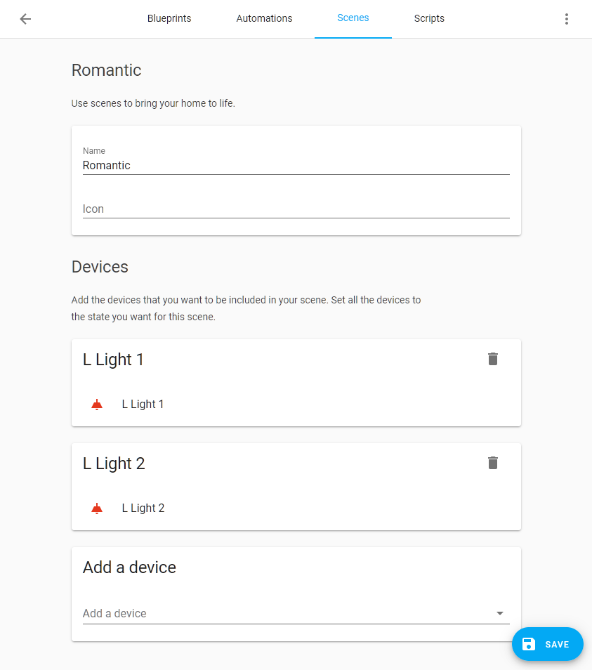

# Scenes editor

<p className="text-xl font-semibold">From the UI choose **Settings** which is located in the sidebar, then click on **Automations & Scenes** to go to the scene editor. Press the **Add Scene** button in the lower right corner to get started.</p>

Choose a meaningful name for your scene.



Select all the devices (or entities when advanced mode is enabled on your user profile) you want to include in your scene. The state of your devices will be saved, so it can be restored when you are finished creating your scene. Set the state of the devices to how you want them to be in your scene, this can be done by clicking on it and edit the state from the popup, or any other method that changes the state. On the moment you save the scene, all the states of your devices are stored in the scene. When you leave the editor the states of the devices are restored to the state from before you started editing. The menu on the top-right has options to **Duplicate scene** and **Delete scene**.

A scene can be called in automation action and scripts using a turn on scene action:

```yaml
action: scene.turn_on
target:
  entity_id: scene.my_unique_id
```

## Updating your configuration to use the editor 

First, check that you have activated the configuration editor.

```yaml
# Activate the configuration editor
config:
```

The scene editor reads and writes to the file `scenes.yaml` in the root of your [configuration](https://www.home-assistant.io/docs/configuration/) folder. Currently, both the name of this file and its location are fixed. Make sure that you have set up the scene integration to read from it:

```yaml
# Configuration.yaml example
scene: !include scenes.yaml
```

If you still want to use your old scene section, add a label to the old entry:

```yaml
scene old:
  - name: ...
```

You can use the scene: and scene old: sections at the same time:

- `scene old`: to keep your manual designed scenes
- `scene`: to save the scene created by the online editor

```yaml
scene: !include scenes.yaml
scene old: !include_dir_merge_list scenes
```
## Migrating your scenes to scenes.yaml 

If you want to migrate your old scenes to use the editor, you’ll have to copy them to `scenes.yaml`. Make sure that `scenes.yaml` remains a list! For each scene that you copy over, you’ll have to add an `id`. This can be any string as long as it’s unique.

For example:

```yaml
# Example scenes.yaml entry
- id: my_unique_id # <-- Required for editor to work.
  name: Romantic
  entities:
    light.tv_back_light: on
    light.ceiling:
      state: on
      xy_color: [0.33, 0.66]
      brightness: 200
```

:::note
Any comments in the YAML file will be lost and templates will be reformatted when you update a scene via the editor.
:::