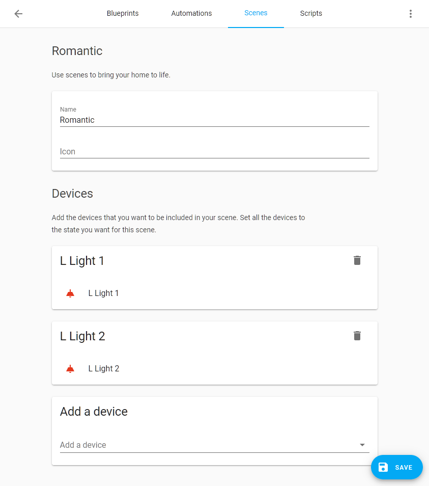

# 场景编辑器

<p className="text-xl font-semibold">从UI界面选择位于侧边栏的**设置**，然后点击**自动化与场景**进入场景编辑器。按下右下角的**添加场景**按钮开始。</p>

为你的场景选择一个有意义的名称。



选择所有你想包含在场景中的设备（或当在用户配置中启用高级模式时选择实体）。你的设备状态将被保存，这样当你完成场景创建后可以恢复。设置设备的状态为你希望它们在场景中呈现的样子，这可以通过点击它并从弹出窗口编辑状态来完成，或使用任何其他改变状态的方法。在你保存场景的那一刻，所有设备的状态都会被存储在场景中。当你离开编辑器时，设备的状态会恢复到你开始编辑前的状态。右上角的菜单有**复制场景**和**删除场景**的选项。

场景可以在自动化动作和脚本中使用turn on scene动作调用：

```yaml
action: scene.turn_on
target:
  entity_id: scene.my_unique_id
```

## 更新你的配置以使用编辑器

首先，检查你是否已激活配置编辑器。

```yaml
# 激活配置编辑器
config:
```

场景编辑器会读取和写入[配置](https://www.home-assistant.io/docs/configuration/)文件夹根目录下的`scenes.yaml`文件。目前，该文件的名称和位置都是固定的。确保你已设置场景集成从中读取：

```yaml
# Configuration.yaml 示例
scene: !include scenes.yaml
```

如果你仍想使用旧的场景部分，请为旧条目添加标签：

```yaml
scene old:
  - name: ...
```

你可以同时使用scene:和scene old:部分：

- `scene old`：保留你手动设计的场景
- `scene`：保存由在线编辑器创建的场景

```yaml
scene: !include scenes.yaml
scene old: !include_dir_merge_list scenes
```
## 将你的场景迁移到scenes.yaml

如果你想迁移旧场景以使用编辑器，你需要将它们复制到`scenes.yaml`。确保`scenes.yaml`保持列表格式！对于你复制的每个场景，你必须添加一个`id`。这可以是任何字符串，只要它是唯一的。

例如：

```yaml
# scenes.yaml 条目示例
- id: my_unique_id # <-- 编辑器工作所必需。
  name: Romantic
  entities:
    light.tv_back_light: on
    light.ceiling:
      state: on
      xy_color: [0.33, 0.66]
      brightness: 200
```

:::note
当你通过编辑器更新场景时，YAML文件中的任何注释都将丢失，模板也会被重新格式化。
:::