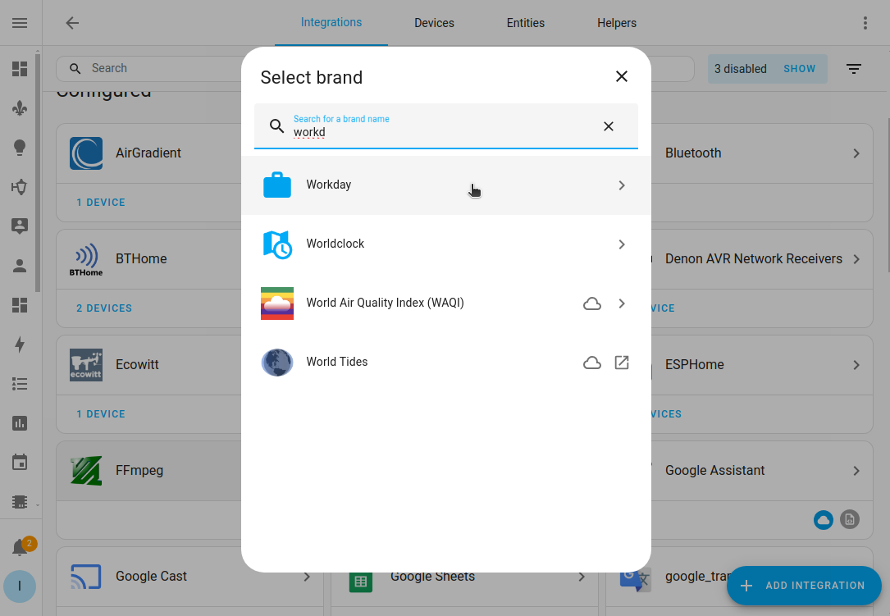

import { ArrowLeft, EllipsisVertical, SquareCheck } from 'lucide-react'

# 添加集成

让我们从添加第一个集成开始。在本教程中，我们将使用 **Workday** 集成。它可以用于基于工作日、休息日或假期进行自动化。本教程不需要任何智能设备。

## 先决条件

本教程假设您已经[安装了 Home Assistant](/docs/started/installation/) 并至少完成了[入门步骤](/docs/started/Onboarding/)。

## 添加集成

1. 转到[设置 > 设备和服务](https://my.home-assistant.io/redirect/integrations)。
    - 集成页面显示您已经安装的所有集成。其中一些是自动安装的。
    - 如果在您的网络中发现了设备，您将在**已发现**部分看到它们。
        

2. 如果为您发现了任何设备，您现在可以添加它们。

- 在**已发现**下，选择集成上的**添加**。
- 如果需要额外配置，请按照 UI 中的步骤操作。
- 如果没有发现设备，不用担心，我们将在下一步添加一个集成。

3. 在右下角，选择**添加集成**。

4. 输入 `workd` 并选择 **Workday** 集成。
 

5. 给它一个名称，例如 `Workday tomorrow`，并选择国家。
- 国家用于确定当地的假期。
- 选择提交，然后完成。

6. 配置选项。

- 例如，如果周一不是您的工作日，选择"x"将其移除。
- 要检查明天是否是工作日，在**偏移**下输入 `1`。
- 根据需要填写所有其他选项。至少需要定义**假期**和**语言**。
- 选择**提交**。

7. 选择区域，例如办公室，然后选择**完成**。

8. 您现在在列表中看到 **Workday** 集成。
    - 恭喜！您已添加了第一个集成。任务完成。
        

## 查看集成详情

1. 选择集成。
    
- 这将打开集成详情页面。
- 我们看到这个集成有一个服务和一个实体。
- **文档**打开此集成的文档页面。
- **已知问题**打开 GitHub 问题跟踪器，筛选出与此集成相关的问题。
    - 这允许您查看其他用户是否报告了与该集成相关的问题。
- **启用调试日志**让您[激活该集成的调试日志](https://www.home-assistant.io/docs/configuration/troubleshooting/#debug-logs-and-diagnostics)。

2. 选择服务，打开服务信息页面。

- 在**日志**中，您可以看到该传感器的时间线。
- 在**传感器**下，您可以看到集成提供的所有传感器。这里，我们只有一个，但如果您有气候设备，例如，您可能会在这里看到温度、湿度和电池状态。
- 您还可以看到 **Workday** 尚未在任何自动化、脚本或场景中使用。

3. 选择返回按钮 <ArrowLeft className='align-middle' size={18} />。然后，选择**实体**打开实体列表。
    - 尽管您的 Home Assistant 已经有许多实体，您在实体表中只看到 1 个条目。
    - 这是因为它是[过滤的](https://www.home-assistant.io/docs/organizing/tables#filtering-items-in-a-table)。
    - 您可以看到实体 ID，它由域（设备类型的技术术语）和实体名称组成，格式如下：`domain.entity_name`。

## 修改集成

1. 要更改名称，选择三个点 <EllipsisVertical className='align-middle' size={18} /> 菜单，然后选择重命名。

2. 您还可以添加另一个 Workday 传感器。例如，如果您想知道同事何时有假期。
- 选择**添加条目**，给它一个名称并定义您的选项。
- 选择感兴趣的国家。

3. 就是这样！

-  <SquareCheck className='align-middle' size={18} />您已经了解了集成页面的概览，并知道在哪里可以找到集成详情页面、传感器信息页面和实体表。
-  <SquareCheck className='align-middle' size={18} /> 您已经学会了重命名、修改和删除集成。
- 如果您想找到更多集成，请查看[集成文档](https://www.home-assistant.io/integrations/workday/)。
- 我们现在准备在自动化中使用 **Workday**。

