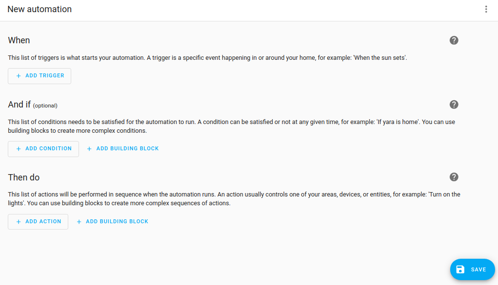
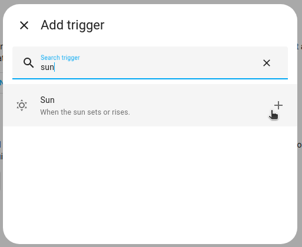

# 自动化 Home Assistant

设备设置完成后，是时候添加点睛之笔：自动化。

我们将创建两个自动化：一个是在日落时打开灯光，另一个是在工作日前一天的晚上特定时间调暗灯光。

## 在日落前打开灯光

### 先决条件

本教程假设您已经：

- [安装了 Home Assistant](/docs/started/installation)
- 完成了[入门步骤](/docs/started/Onboarding)
- 按照[添加集成](/docs/started/Adding%20integrations/)的步骤操作
- 有一个已集成到 Home Assistant 的灯光设备
    - 如果您还没有灯光设备，并且不确定购买什么，可以尝试 [Philips Hue](https://www.home-assistant.io/integrations/hue/)、[nanoleaf](https://www.home-assistant.io/integrations/nanoleaf/) 或支持 [WLED](https://www.home-assistant.io/integrations/wled/) 的产品

### 自动在日落前打开灯光

1. 转到[设置 > 自动化和场景](https://my.home-assistant.io/redirect/automations)并选择**创建自动化**。

    - 然后，选择**创建新自动化**。这将打开一个空的自动化页面。
    

2. 第一步是定义触发自动化运行的条件。

    - 在这种情况下，我们想使用日落事件来触发我们的自动化。
    - 选择添加触发器，输入 Sun 并选择它。
        

3. 选择**日落**。
    - 我们希望自动化在日落前一点触发，所以添加 `-00:30` 作为偏移量。这表示自动化将在日落前 30 分钟触发。很棒！
    

4. 定义好触发器后，我们需要定义应该发生什么。
    - 选择**添加动作**。

5. 输入 `light` 并选择**灯光打开**。
    - 对于这个自动化，我们将打开客厅的所有灯光，所以选择**区域**。
    - 这只有在您的灯光被分配到区域时才有效。
    - 要了解更多关于在区域中分组设备的信息，请参考[区域文档](https://www.home-assistant.io/docs/organizing/areas/)。
    

6. 要保存自动化，选择**保存**。给自动化一个名称，添加**描述**，然后再次**保存**。

    - 选择名称时，要具体，这样即使您有很多自动化也能找到它。例如，`在日落时打开客厅台灯`。
    - 现在等待直到日落前 30 分钟，看看您的自动化魔法！
    - 或者按照这些步骤[立即测试您的自动化](https://www.home-assistant.io/docs/automation/troubleshooting/#testing-your-automation)。

## 在工作日前一天晚上调暗灯光

这个自动化在工作日前一天的特定时间调暗灯光。

### 先决条件

本教程假设您已经：

- [安装了 Home Assistant](/docs/started/installation)
- 完成了[入门步骤](/docs/started/Onboarding)
- 按照[添加集成](/docs/started/Adding%20integrations/)的步骤操作
- 有一个已集成到 Home Assistant 的灯光设备

### 在工作日前一天晚上调暗灯光

1. 转到[设置 > 自动化和场景](https://my.home-assistant.io/redirect/automations)并选择**创建自动化**。

    - 然后，选择**创建新自动化**。这将打开一个空的自动化页面。
    

2. 我们希望灯光在 21:45 开始调暗。这意味着我们需要一个由时间触发的自动化。
    - 选择**添加触发器 > 时间和位置 > 时间**。
    - 选择**固定时间**并输入时间。
    

3. 我们只想在明天是工作日时执行这个操作。
    - 选择**添加条件 > 实体 > 状态**。
    - 在**实体**下，输入 `workd` 并选择您的工作日传感器。
    - 在**状态**下，选择**开启**。

4. 接下来，我们希望确保只在灯光实际开启时才调暗。如果灯光没有开启，就没有理由这样做。

    - 为此，我们使用**如果-那么**动作。选择**添加动作 > 构建块 > 如果-那么**。
    - 您现在得到一个名为**有条件执行动作**的块。从**实体**列表中选择您的灯光。
    - 在**如果**下，选择**添加条件 > 实体 > 状态**。
    - 在**状态**下，选择**开启**。
    

5. 现在我们要定义当条件为真时（当灯光开启时）执行的动作。
    - 在**那么**下，选择**添加动作 > 灯光打开**。
    - 在**实体**下，选择您的灯光。
    - 定义灯光设置，如亮度、温度或颜色。可用设置取决于您的灯光。
    

6. 要保存自动化，选择`保存`。给自动化一个名称（例如，`在工作日前一天晚上调暗客厅台灯`），添加`描述`，然后再次`保存`。

7. [测试您的自动化](https://www.home-assistant.io/docs/automation/troubleshooting/#testing-your-automation)

如果您在完成这个入门教程后对自动化感兴趣，我们推荐以下页面：

- 触发器
- 条件
- 动作

