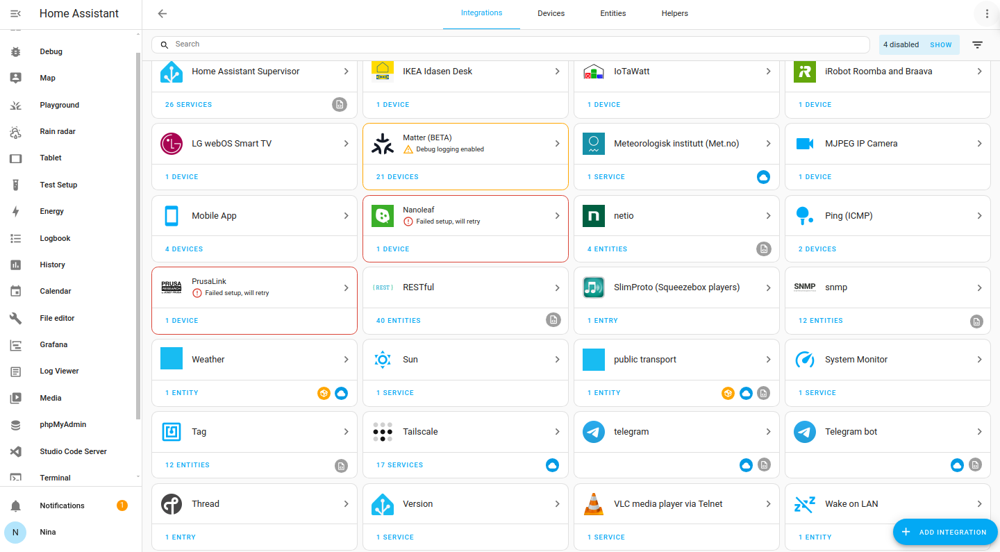
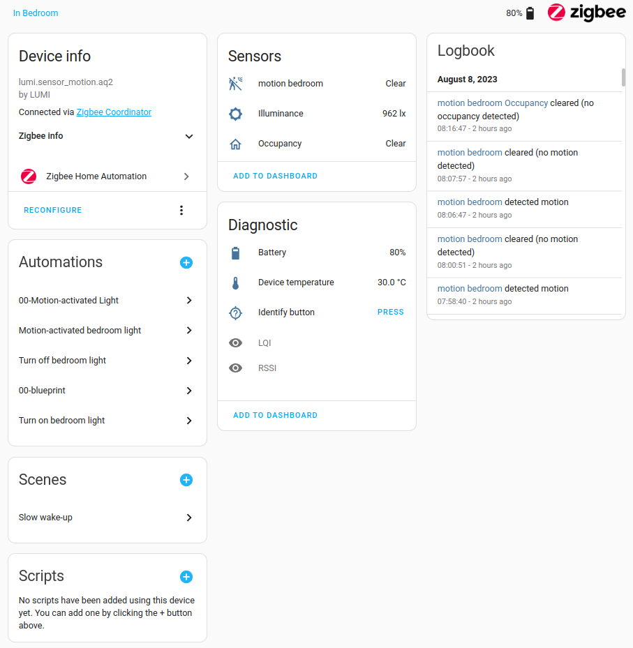
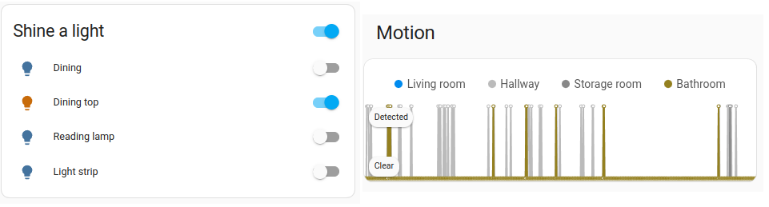
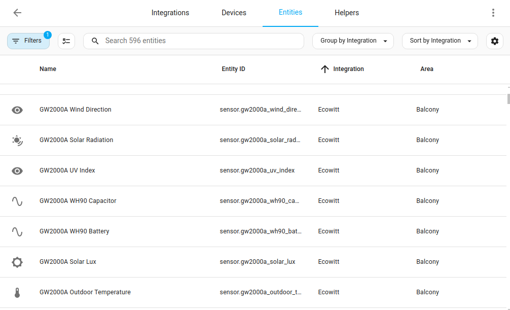
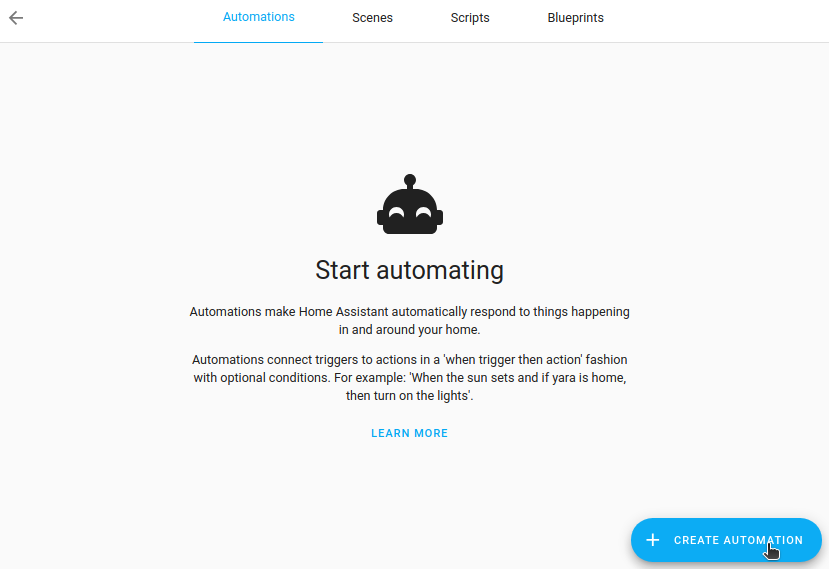
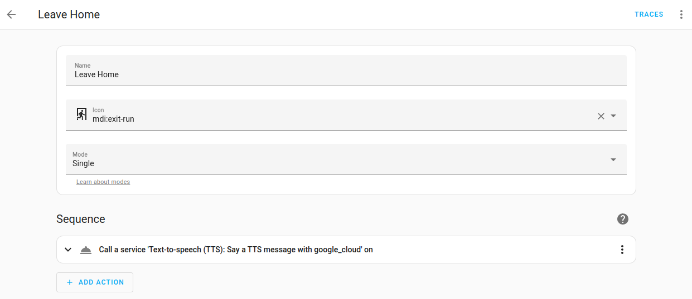
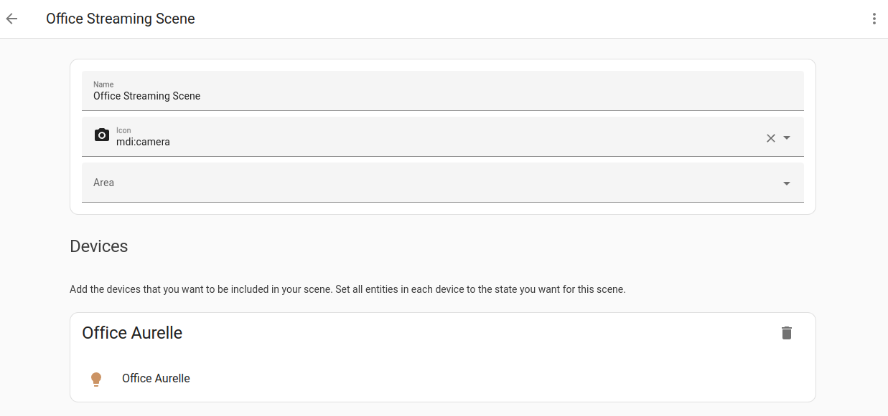
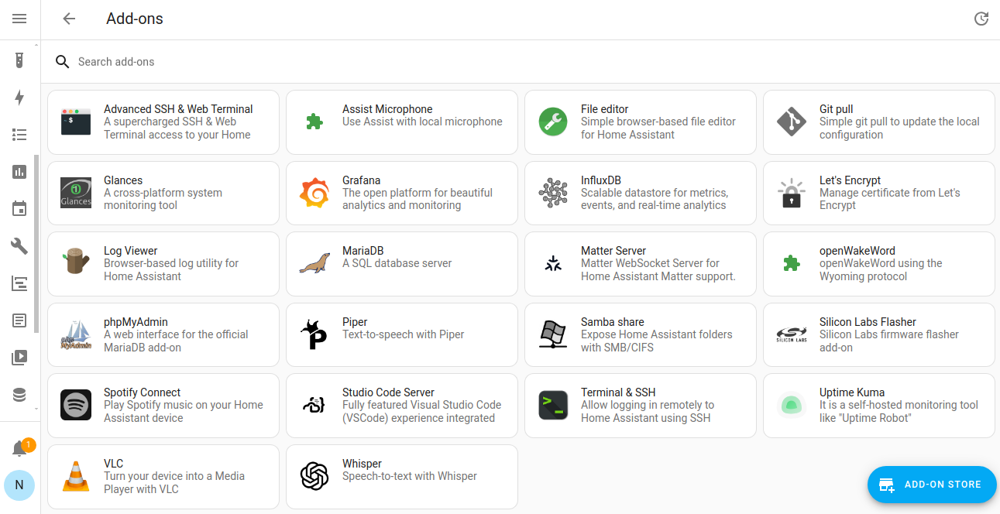

# 概念和术语
现在您已经进入 Home Assistant，让我们来了解最重要的概念。

## 集成（Integrations）

集成是允许 Home Assistant 连接到其他软件和平台的软件组件。例如，飞利浦的 Hue 产品会使用 Philips Hue 集成，让 Home Assistant 能够与硬件控制器 Hue Bridge 通信。任何连接到 Hue Bridge 的 Home Assistant 兼容设备都会在 Home Assistant 中显示为[设备](https://www.home-assistant.io/getting-started/concepts-terminology/#devices)。

一些集成卡片会显示图标：

import CloudIconUrl from './img/cloud_icon.png';
import ConfigFileUrl from './img/config-file_icon.png';
import CustomIconUrl from './img/custom_icon.png';

- 
云图标  表示该集成依赖于云服务。

- 
文件图标  表示该集成不是通过 UI 设置的。您要么是在 `configuration.yaml` 文件中设置的，要么是作为另一个集成的依赖项设置的。如果您想配置它，需要在 `configuration.yaml` 文件中进行。

- 自定义图标  表示这不是官方的 Home Assistant 集成，而是自定义制作的。它可能是从其他来源导入的，例如从 HACS 下载的。

有关兼容集成的完整列表，请参考[集成](/docs/started/installation/)文档。

添加集成后，硬件和/或数据将在 Home Assistant 中表示为[设备和实体](https://www.home-assistant.io/getting-started/concepts-terminology/#devices)。

## 设备（Devices）

设备是一个或多个实体的逻辑分组。设备可能代表一个物理设备，它可以有一个或多个传感器。这些传感器作为与设备关联的实体出现。例如，运动传感器被表示为一个设备。它可能提供运动检测、温度和光照水平作为实体。实体具有状态，例如检测到运动时为"已检测"，没有运动时为"清除"。

设备和实体在 Home Assistant 中无处不在。举几个例子：

- [仪表板](https://www.home-assistant.io/getting-started/onboarding_dashboard/)可以显示实体的状态。例如，灯是开还是关。
- [自动化](https://www.home-assistant.io/getting-started/concepts-terminology/#automations)可以由实体的状态变化触发。例如，运动传感器实体检测到运动并触发灯打开。
- 为灯保存的预定义颜色和亮度设置作为[场景](https://www.home-assistant.io/getting-started/concepts-terminology/#scenes)。
    

## 实体（Entities）

实体是 Home Assistant 中存储数据的基本构建块。实体代表 Home Assistant 中的传感器、执行器或功能。实体用于监视物理属性或控制其他实体。实体通常是设备或服务的一部分。实体具有状态。
    

实体表的截图。每一行代表一个实体。

## 区域（Areas）

Home Assistant 中的区域是设备和实体的逻辑分组，旨在匹配物理世界中的区域（或房间）：您的家。例如，客厅区域将客厅中的设备和实体分组。区域允许您针对整个设备组调用服务。例如，关闭客厅中的所有灯。您家中的位置，如客厅、舞池等。区域可以分配给楼层。区域也可以用于自动生成的卡片，例如[区域卡片](https://www.home-assistant.io/dashboards/area/)。

## 自动化（Automations）

一组可重复的动作，可以设置为自动运行。自动化由三个关键组件组成：

1. 触发器 - 启动自动化的事件。例如，当太阳落山或运动传感器被激活时。

2. 条件 - 在运行动作之前必须满足的可选测试。例如，如果有人在家的。

3. 动作 - 与设备交互，例如打开灯。

要了解自动化的基础知识，请参考[自动化基础](https://www.home-assistant.io/docs/automation/basics/)页面或尝试[创建自动化](https://www.home-assistant.io/getting-started/automation)。

## 脚本（Scripts）

与自动化类似，脚本是可以运行的可重复动作。脚本和自动化的区别在于脚本没有触发器。这意味着脚本不能自动运行，除非它们在自动化中使用。如果您在不同的自动化中执行相同的动作或从仪表板触发它们，脚本特别有用。有关如何创建脚本的信息，请参考[脚本](https://www.home-assistant.io/integrations/script/)文档。

## 场景（Scenes）

场景允许您为设备创建预定义的设置。类似于手机上的驾驶模式或汽车中的驾驶员配置文件，它可以改变环境以适应您。例如，您的观影场景可能会调暗灯光，打开电视并增加音量。这可以保存为场景，无需每次都设置单个设备即可使用。

要了解如何使用场景，请参考[场景](https://www.home-assistant.io/integrations/scene/)文档。

## 附加组件（Add-ons）

附加组件是提供 Home Assistant 额外功能的第三方应用程序。附加组件直接在 Home Assistant 旁边运行，而集成则将 Home Assistant 连接到其他应用程序。附加组件仅由 Home Assistant 操作系统和 Home Assistant Supervised [安装类型](/docs/started/installation/)支持。

附加组件从附加组件商店安装，位于**[设置 > 附加组件](https://my.home-assistant.io/redirect/supervisor)**下。如果您现在感到好奇并想安装每个看起来有趣的附加组件：请注意，附加组件可能会使用相当多的资源，包括磁盘空间、内存和处理器上的额外负载。

最常用的附加组件是那些提供[文件访问和编辑](https://www.home-assistant.io/docs/configuration/#to-set-up-access-to-the-files-and-prepare-an-editor)的附加组件。

