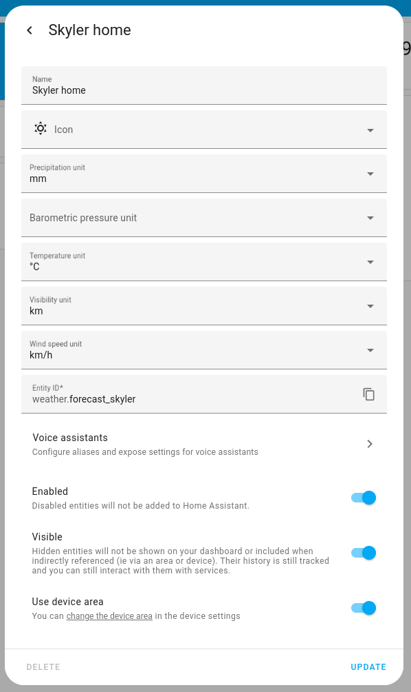

import CustomIconUrl from './img/mdi-edit.png'
import { EllipsisVertical, Settings } from 'lucide-react'

# 编辑仪表板

仪表板是可自定义的页面，用于显示智能家居设备的信息。

## 仪表板、卡片和视图

截图显示了一个**概览**仪表板，其中包含许多[卡片](https://www.home-assistant.io/dashboards/cards/)来表示传感器值。例如，一些灯的状态、媒体播放器和一些温度值。它还显示控制元素。例如，您可以改变通风、灯的颜色，或打开智能电视并启动 YouTube。

### 视图

以下截图显示了在[砌体视图](https://www.home-assistant.io/dashboards/masonry/)布局中完全填充的仪表板。顶部蓝色菜单栏中的每个图标代表一个不同的标签页。每个标签页包含一个[视图](https://www.home-assistant.io/dashboards/views/)。

砌体视图布局中完全填充的概览仪表板截图。

以下截图显示了在[分区视图](https://www.home-assistant.io/dashboards/sections/)布局中完全填充的仪表板。

分区视图布局中完全填充的仪表板。

### 多个仪表板

在左侧边栏中，您可以看到不同仪表板的名称。Home Assistant 开箱即用就带有[多个仪表板](https://www.home-assistant.io/dashboards/dashboards/)。

- 概览
- 能源
- 地图
- 日志
- 历史
- 待办事项列表

### 首次接触概览仪表板

**概览**[仪表板](https://www.home-assistant.io/dashboards/)是您在[入门过程](https://www.home-assistant.io/getting-started/onboarding)后看到的第一个页面。

如果您刚刚完成入门，您的仪表板将几乎是空的。它使用[砌体视图](https://www.home-assistant.io/dashboards/masonry/)布局，并显示自动检测到的设备的卡片。根据您家中的设备，您的仪表板可能看起来完全不同。

带有蓝牙设备的概览仪表板截图。

让我们看看检测到的设备以及仪表板上用于表示它们的卡片。

- 1 个 Sonos 扬声器：[媒体控制](https://www.home-assistant.io/dashboards/media-control/)卡片
- 1 个人（离开）：[实体](https://www.home-assistant.io/dashboards/entities/)卡片
- 1 个天气预报：[天气预报](https://www.home-assistant.io/dashboards/weather-forecast/)卡片
- 2 个温度传感器：[实体](https://www.home-assistant.io/dashboards/entities/)卡片

### Sonos 扬声器

如果您有连接到 Wi-Fi 的智能扬声器，例如，这可以被检测到。

### 人员

入门后，这里显示的第一个人是 Home Assistant 所有者。在名称旁边，它显示该人不在家。您可以跟踪一个人是否在场，并基于此创建自动化。例如，当所有人都离开家时调低暖气。有关基于存在检测的自动化的更多信息，请从[存在检测](https://www.home-assistant.io/getting-started/presence-detection/)开始。

### 天气预报

如果您在入门过程中提供了位置，天气预报卡片会自动显示。

### 温度传感器

显示温度传感器是因为这里使用的 Home Assistant 设备（Raspberry Pi）具有内置的蓝牙模块。在 Giulia 的家中，有 2 个蓝牙温度传感器。如果您的 Home Assistant 还没有蓝牙模块，您家中的蓝牙设备将不会自动显示。

如果您的 Home Assistant 有其他控制器，例如 [Zigbee](https://www.home-assistant.io/integrations/zha/) 或 [Z-Wave](https://www.home-assistant.io/integrations/zwave_js/) 控制器，并且您有 Zigbee 或 Z-Wave 设备，这些设备可能会被检测到并显示在这里。但是，这些设备通常需要先配对。

## 创建新仪表板和编辑卡片

默认的**概览**仪表板在您添加新设备时会自动更新。但是，一旦您开始编辑默认仪表板，它将不再自动更新。因此，我们在这里通过添加新仪表板开始。这让我们可以保留默认的**概览**仪表板。

在以下步骤中，我们将创建一个新仪表板并编辑一些卡片设置。

1. 转到[设置 > 仪表板](https://my.home-assistant.io/redirect/lovelace_dashboards)并选择**添加仪表板**。

2. 在对话框中，选择**默认仪表板**。

3. 在**添加新仪表板**对话框中，输入名称并选择图标。
    - 保持**仅管理员**和**在侧边栏显示**选项不变。
    - 选择**创建**。
    - **结果**：仪表板已添加。

4. 打开您的新仪表板，在屏幕右上角选择编辑  图标按钮。

5. 通过编辑仪表板，您正在接管此仪表板的控制权。
    - 这意味着当新的仪表板元素可用时，它将不再自动更新。
    - 要继续，在对话框中，选择三个点 <EllipsisVertical className='align-middle' size={18} /> 菜单，然后选择**接管控制**。
    - 在继续之前阅读并接受此内容。
    - 您无法将此特定仪表板恢复到自动更新。但是，您可以创建一个新的默认仪表板。

6. 您的仪表板可能还没有太多内容。
    - 如果您家中有智能家居设备，一些设备可能已自动连接。
    - 在此示例中，一些蓝牙温度传感器和 AV 接收器自动连接。
    - 默认情况下有一些卡片，例如天气、为设置系统的人准备的卡片和文本转语音服务。

7. 接下来，我们要编辑天气卡片。
    - 选择天气卡片。
    - 然后，选择齿轮 <Settings className='align-middle' size={18} />。
        

8. 如果您愿意，可以更改任何单位。
    - 不要更改**实体 ID**。
    - 完成后，选择**更新**。
        

9. 接下来，我们要为此天气服务添加一个新卡片。
    - 再次选择天气卡片，选择三个点 <EllipsisVertical className='align-middle' size={18} />，然后选择**设备信息**。
    - 在**传感器**下，选择**添加到仪表板**，然后选择不同的卡片。
    

10. 从列表中选择**显示当前天气和预报**。

11. 选择要在卡片上显示的详细信息。

    - **保存**您的更改
    - 您现在在仪表板上看到预报卡片。

12. 现在让我们删除另一个天气卡片。
    - 在右上角，选择铅笔。
    
    - 在卡片上，选择三点菜单并选择**删除**。
    

13. 最后，我们要将天气卡片移动到左上角。

- 在卡片底部，选择数字或使用减号按钮输入 1。
- 如果您想移动其他卡片，请重复此操作。
- 完成后，在右上角选择**完成**。

14. 如果您想更改任何其他卡片，请选择卡片上的**编辑**按钮。

15. 恭喜！您已完成第一个仪表板自定义。

16. 当您的仪表板仍然很小时，这是[将其迁移到分区视图](https://www.home-assistant.io/dashboards/views/#migrating-a-view-into-a-sections-view)的好时机。
    - 分区视图提供拖放、自定义列数和宽度以及更多标题选项等功能。
    - 要了解更多信息，请查看[分区视图](https://www.home-assistant.io/dashboards/sections/)的文档。

## 了解更多关于仪表板的信息

如果您想了解更多关于仪表板、视图和卡片的信息，请查看以下主题：

1. 查看[仪表板介绍](https://www.home-assistant.io/dashboards/)并了解[多个仪表板](https://www.home-assistant.io/dashboards/dashboards)。
2. 了解更多关于[视图类型](https://www.home-assistant.io/dashboards/views/)的信息
3. 了解如何[添加卡片](https://www.home-assistant.io/dashboards/cards/#adding-cards-to-your-dashboard)到视图。

## 下一步：集成

要继续本教程，请选择下面的按钮了解集成。

## 相关主题

- [仪表板](https://www.home-assistant.io/dashboards/)
- [视图](https://www.home-assistant.io/dashboards/views/)
- [向视图添加卡片](https://www.home-assistant.io/dashboards/cards/#adding-cards-to-your-dashboard)

    

    

