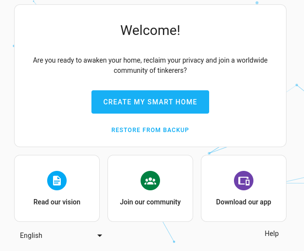
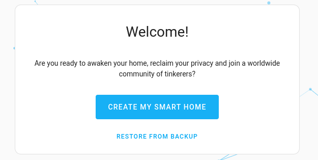
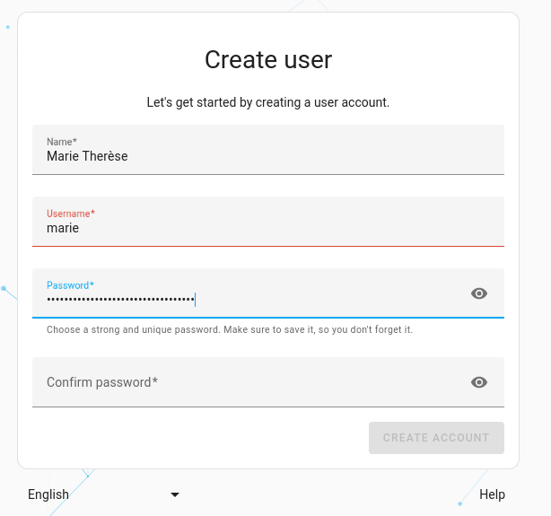
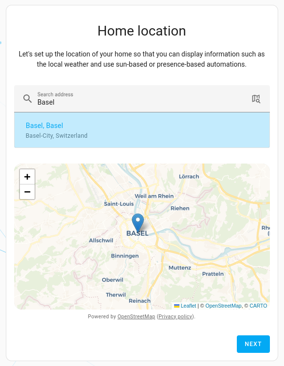
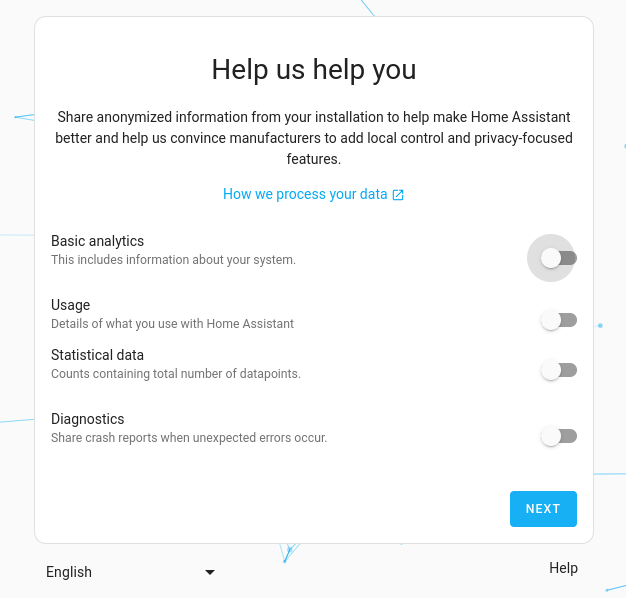
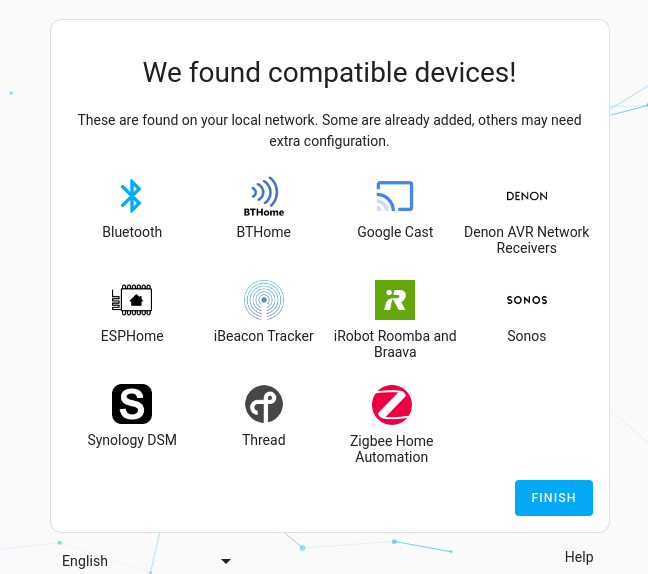

# Home Assistant 入门指南

在您的设备上[安装](/docs/started/installation/)好 Home Assistant 后，需要完成以下 5 个步骤来完成设置。

1. 在浏览器地址栏输入以下网址：http://homeassistant.local:8123/
    - **结果**：您将看到 **准备 Home Assistant** 页面。根据您的硬件和网络连接情况，准备过程可能需要一些时间。
        - Home Assistant 会下载最新版本的 Home Assistant Core（约 700 MB）。
    - 如果在此步骤遇到问题，请参考[安装故障排除](/docs/started/installation/troubleshooting)。
    - 准备完成后，将显示欢迎界面。
        

2. 您可以选择创建新安装或从备份恢复现有安装：
    - **选项 1：全新安装**：如果是首次安装，我们将创建 Home Assistant 的所有者账户。
        - 这是一个管理员账户，拥有所有权限。
        - 选择 **创建我的智能家居**。
            
        - 输入姓名、用户名和密码。
            - 用户名必须使用小写字母且不能包含空格。
            - **提示**：**姓名**是显示在界面上的名称，用户名用于登录。
            
            - 请妥善保存姓名、用户名和密码。所有者凭据一旦丢失将无法恢复。
            - 选择 **创建账户**。
    - **选项 2：从备份恢复**：如果想恢复之前安装的备份，请选择 **从备份恢复**。
        - 此时可以忽略后续步骤，直接按照[从备份恢复](https://www.home-assistant.io/common-tasks/general/#restoring-a-backup)的说明操作。
            - 如果您使用的是 Home Assistant Yellow，请参考 [Yellow 的备份恢复文档](https://yellow.home-assistant.io/guides/restore-backup/)。
            - 如果您使用的是 Home Assistant Green，请参考 [Green 的备份恢复文档](https://green.home-assistant.io/guides/restore-backup/)。

3. 输入您家的位置。
    - 家庭位置用于配置时区、计量单位和货币。
    - 同时也用于创建家庭[区域](../installation/zone.mdx)，默认半径为 100 米。
    - 这些信息之后都可以在设置中修改。
    - 这个家庭区域可以用于自动化场景，比如显示天气、日出时打开窗帘，或者离家时启动扫地机器人。
    - 找到位置后，选择 **下一步**。
    

4. 选择您愿意分享的信息。
    - 默认情况下分享功能是关闭的，但我们鼓励您分享部分数据。
    - 这些信息能帮助我们了解需要支持哪些平台，以及应该重点关注哪些方面。
    - 数据会经过匿名化和聚合处理。要查看我们根据这些数据生成的图表，请访问我们的[分析页面](https://analytics.home-assistant.io/)。
    - 确认后，选择 **下一步**。
    

5. 查看 Home Assistant 在您的网络中发现的设备。
    - 如果看到的设备数量比下图少，不用担心，之后随时可以手动添加设备。
    - 选择 **完成**。
    

6. 现在您的 Home Assistant 已经准备就绪。
    - 您将看到默认仪表板。
    - 如果系统自动发现并设置了一些设备，这些设备会显示在界面上。

