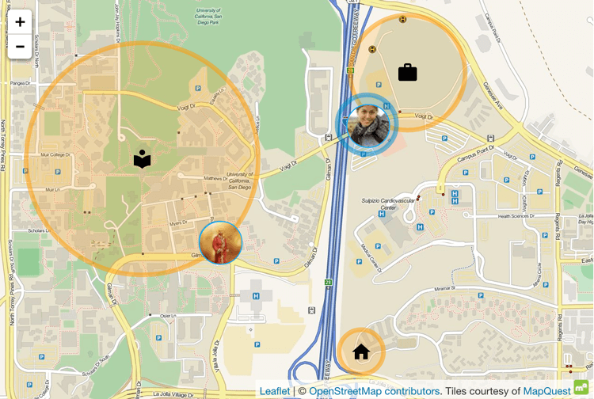

# 设置存在检测

区域存在检测可以检测人们是否在特定区域内，这对于自动化来说是非常有价值的输入。知道谁在家或他们在哪里可以开启一系列自动化选项：

- 当我的孩子到达学校时发送通知给我

- 当我离开工作时打开空调

地图仪表板显示学校、工作区域和家庭区域以及两个人的位置。

## 关于设置区域存在检测

设置区域存在检测有几种不同的方法。一种方法是在手机上运行一个应用程序，将详细的位置信息发送到您的 Home Assistant 实例。另一种检测存在的方法是检查哪些设备连接到网络。如果您有我们[支持的路由器](https://www.home-assistant.io/integrations/#presence-detection)，就可以这样做。通过利用路由器已经知道的信息，您可以检测人们是否在家。

## 使用手机添加区域存在检测

### 先决条件

- [已安装 Home Assistant](https://www.home-assistant.io/installation/)

- 已完成[入门步骤](https://www.home-assistant.io/getting-started/onboarding/)
- [已启用远程访问](https://www.home-assistant.io/docs/configuration/remote/)
    - 最简单的方法是启用
    - [Home Assistant Cloud](https://nabucasa.com/config/)

- 手机要求：
    - Android（Android 5 或更高版本）或 iPhone（iOS 15 或更高版本）
    - 有互联网访问权限的手机套餐
    - 可以访问运行 Home Assistant 的本地网络

- 手机上已安装[Home Assistant Companion 应用](https://companion.home-assistant.io/docs/getting_started/)。
    - 在设置过程中，确保授予**位置访问权限**。
        - 位置访问会为该设备创建一个 `device_tracker` 实体。这个实体可以用于自动化和条件。

### 使用手机添加区域存在检测

1. 在手机上打开 Home Assistant Companion 应用并登录到您的 Home Assistant 实例。

2. 在**连接到 Home Assistant**的屏幕上，确保激活**启用位置跟踪**。
    - 选择**继续**。

3. 转到[设置 > 设备和服务](https://my.home-assistant.io/redirect/integrations)并查找新添加的集成：**移动应用**。
在集成卡片上，选择**1 设备**。这将打开设备信息页面。
您现在可以看到您的手机名称及其实体。

4. 要在地图上查看手机的位置，打开**地图**仪表板。
    - 您现在在地图上看到一个带有您首字母的圆圈。
    - 它显示您手机的当前位置。
    - 要查看详细信息，选择该首字母。
        - 打开**属性**列表以查看手机的**纬度**、**经度**和信息的**来源**。
        - 来源是该设备的 `device_tracker` 实体，例如 `device_tracker.pixel_7_pro`。

5. 要查看实体详情和历史记录，转到[设置 > 设备和服务 > 实体](https://my.home-assistant.io/redirect/entities)，在搜索字段中输入 `devi` 并从列表中选择您的 `device_tracker` 实体。

6. 检查您的[区域](https://www.home-assistant.io/integrations/zone/)以为自动化做准备。
    - 您的家庭区域在入门过程中已设置，但您可以编辑它。
    - 如果您想在这些区域上实现自动化，可以添加其他区域。

        - 例如，如果您想在离开办公室时启动暖气，可以添加一个名为**办公室**的区域。
        - 在这种情况下，离开办公室区域将是一个自动化触发器。
        - 您也可以将位置信息用作自动化条件，例如，当您有一个在日落时打开灯光的自动化，但只在您在家时执行。

## 为家中其他人添加存在检测

1. 对于您想要进行存在检测的每个人，添加一个设备跟踪器（例如他们的手机）。
    - 您也可以使用智能手表进行存在检测。为此，在设备上安装[Home Assistant Companion 应用](https://companion.home-assistant.io/docs/getting_started/)。确保允许位置跟踪。
    - 要在家庭外部使用它进行区域存在检测，智能手表需要移动套餐。

2. 转到[设置 > 人员](https://my.home-assistant.io/redirect/people)并选择该人员。

3. 向下滚动，在**选择属于此人员的设备**下，选择该设备。

