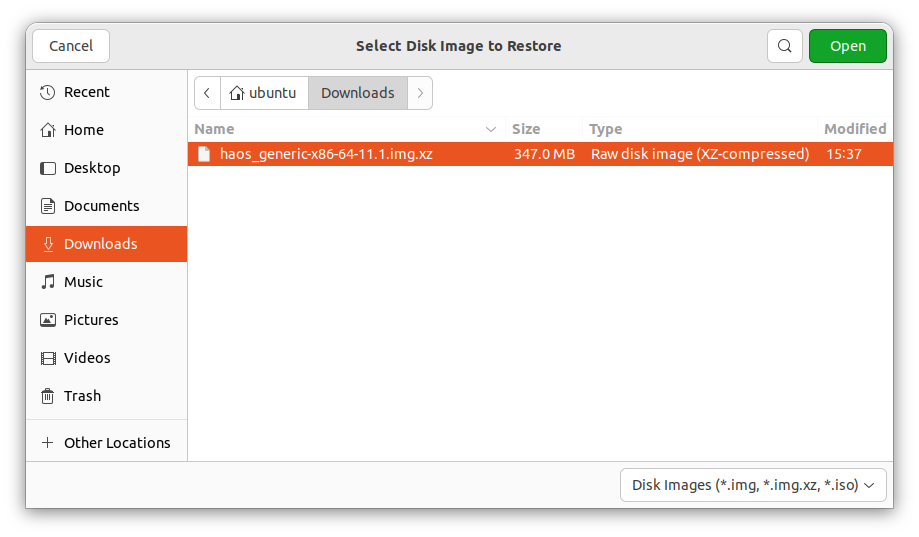
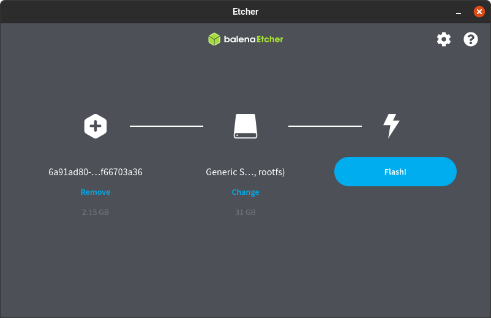

# 通用 x86-64 电脑

## 安装 Home Assistant 操作系统

如果您想轻松开始使用 Home Assistant 或者几乎没有 Linux 经验，请按照本指南操作。

:::tip important

**先决条件**

本指南假设您有一台专门用于运行 Home Assistant 操作系统的通用 x86-64 电脑。

- 这通常是一个基于 Intel 或 AMD 的系统。
- 系统必须支持 64 位并能够使用 UEFI 启动。
    - 过去 10 年生产的大多数系统都支持 UEFI 启动模式。

**概述**

首先，您需要配置您的通用 x86-64 PC 使用 UEFI 启动模式。
然后，将 Home Assistant 操作系统磁盘镜像写入您的启动介质`(注：一般指电脑内部的硬盘)`。

:::

## 配置 x86-64 硬件的 BIOS

要启动 Home Assistant OS，BIOS 需要启用 UEFI 启动模式并禁用安全启动。以下截图来自第 7 代 Intel NUC 系统。BIOS 菜单在您的系统上可能看起来不同。但是，选项应该仍然存在并且名称相似。

1. 要进入 BIOS，启动您的 x86-64 硬件并重复按 `F2` 键（在某些系统上可能是 `Del`、`F1` 或 `F10`）。
    

2. 确保启用 UEFI 启动模式。
    

3. 禁用安全启动。
    

4. 保存更改并退出。

BIOS 配置现在已完成。

## 将 Home Assistant 操作系统（HAOS） 写入 x86-64 硬件

接下来，您需要将 Home Assistant 操作系统镜像写入启动介质，这是您的 x86-64 硬件在运行 Home Assistant 时将从中启动的介质。

:::note

HAOS 没有自动写入镜像的集成安装程序。您将使用 Ubuntu 的 **Disks** 工具或 Balena Etcher 手动写入。

:::

通常，x86-64 启动介质使用内部介质，如 S-ATA 硬盘、S-ATA 固态硬盘(SSD)、M.2 固态硬盘(SSD) 或不可移动的 eMMC。或者，可以使用外部介质，如 USB SSD，但不推荐这样做。

要将 HAOS 镜像写入 x86-64 硬件的启动介质，有两种不同的方法：

**方法 1（推荐）**：从 U盘启动 Ubuntu 并从那里安装 Home Assistant 操作系统。它也适用于带有内部硬盘的笔记本电脑和 PC。

**方法 2**：使用此方法，您可以直接从您的常规计算机将 Home Assistant 操作系统磁盘镜像写入启动介质。步骤稍微复杂一些。如果您有不可移动的内部介质（例如因为您使用的是笔记本电脑）或没有必要的适配器（例如 USB 到 S-ATA 适配器），请改用方法 1。

### 方法 1：通过从 U盘启动 Ubuntu 安装 HAOS

所需材料

- 电脑
- 目标 x86-64 硬件`(注：目标电脑)`，您想在其上安装 Home Assistant 操作系统（HAOS）
- U盘（USB 拇指驱动器足够，大小至少应为 4 GB）
- 互联网连接

#### 通过 U盘从 Ubuntu 安装 HAOS

1. **注意**：此过程将把 Home Assistant 操作系统写入您的设备。
    - 这意味着您将丢失所有数据以及之前安装的操作系统。
    - 在执行此过程之前，请备份您的数据。
2. 在 U盘上创建实时操作系统：
    - 按照 Ubuntu Desktop 说明将 Ubuntu Desktop iso 文件写入 U盘。
3. 将 U盘插入您想要运行 Home Assistant 的系统。
    - 启动实时操作系统。
    - 您可能需要调整启动顺序或使用 F10（根据 BIOS 可能是不同的 F 键）选择 U盘作为启动设备。

4. 出现提示时，确保选择 **试用 Ubuntu**。这将在 U盘上运行 Ubuntu。
    - 系统然后启动 Ubuntu。
    - 将您的系统连接到网络并确保它可以访问互联网。

5. 在 Ubuntu 中，打开浏览器并打开当前文档页面，以便您可以按照步骤操作。
    - [从那里下载镜像](https://github.com/home-assistant/operating-system/releases/download/15.1/haos_generic-x86-64-15.1.img.xz)。

6. 在 Ubuntu 中，在左下角选择 **显示应用程序**。

7. 在应用程序中，搜索并打开 **Disks** 并开始恢复 HAOS 镜像：
    1. 在 Disks 中，在左侧选择您要安装 HAOS 的内部磁盘设备。
    2. 在屏幕顶部，选择三点菜单并选择 **恢复磁盘镜像...**
        
    3. 选择您刚刚下载的镜像。
        
    4. 选择 **开始恢复...**
        
    5. 通过选择 **恢复** 确认。
        
        - 如果您收到 **卸载文件系统时出错** 错误消息，说明 **目标正忙**：
        - 很可能，您正在内部磁盘上运行 Ubuntu。相反，您需要在 U 盘上运行它。
            - 返回步骤 3 并在启动时，确保选择 **试用 Ubuntu**（而不是 **安装 Ubuntu**）。
    6. 在分区概述中，您现在应该看到恢复操作正在进行中。
        - Home Assistant 操作系统现在正在安装到您的系统上。
            
8. 一旦 Home Assistant 操作系统安装完成，关闭系统。
- 一旦 Ubuntu 关闭，移除 U盘（Ubuntu 会通知您何时可以这样做）。
- 您的 Home Assistant 服务器现在已设置好，您可以开始使用它。
- 要使用它，请按照[启动通用 x86-64](https://www.home-assistant.io/installation/generic-x86-64#start-up-your-generic-x86-64) 下的说明进行操作。

### 方法 2：直接从启动介质安装 HAOS

:::note
仅当方法 1 对您不起作用时才使用此方法。
:::

#### 所需材料

- 电脑
- 目标 x86-64 硬件`(注：目标电脑)`，您想在其上安装 Home Assistant 操作系统（HAOS）
- 启动介质
- 互联网连接

#### 将镜像写入启动介质

1. **注意**：此过程将把 Home Assistant 操作系统写入您的设备。
    - 这意味着您将丢失所有数据以及之前安装的操作系统。
    - 在继续下一步之前，请备份您的数据。

2. 将 Home Assistant 启动介质（存储设备）连接到您的计算机。

3. 下载并启动 Balena Etcher。在 Windows 上，您可能需要以管理员权限运行它。

4. 将镜像下载到您的计算机。
    - 复制镜像的 URL。
    - 如果下面有多个链接，请确保选择适合您通用 x86-64 版本的链接。

```
https://github.com/home-assistant/operating-system/releases/download/15.1/haos_generic-x86-64-15.1.img.xz
```

选择并复制 URL 或使用悬停时出现的"复制"按钮。

1. 将 URL 粘贴到浏览器中开始下载。

2. 解压您刚刚下载的文件。

3. 选择"从文件烧录"并选择您刚刚解压的镜像。
    - 不要使用"从 URL 烧录"。在某些系统上不起作用。
    
    **选择目标。**
    
    选择您要用于安装的启动介质（存储设备）。
    
    选择 **烧录！** 开始写入镜像。

    - 如果操作失败，请解压 .xz 文件并重试。
    
    - 当 Balena Etcher 完成写入镜像后，您将看到确认信息。
    

### 启动您的通用 x86-64
- 如果您使用方法 1 进行安装，请确保从系统中移除 U盘。

- 如果您使用方法 2 进行安装，请将启动介质安装到您的 x86-64 硬件中。

1. 插入连接到网络和互联网的以太网电缆。
    - 注意：需要互联网，因为新安装的 Home Assistant OS 尚未包含所有 Home Assistant 组件。它会在首次启动时下载最新版本的 Home Assistant Core。

2. 接通系统电源。如果您有屏幕连接到通用 x86-64 系统，大约一分钟后，Home Assistant 欢迎横幅将出现在控制台中。

:::note

如果机器抱怨找不到可启动介质，您可能需要在 BIOS 中指定 EFI 条目。这可以通过使用实时操作系统（例如 Ubuntu）并运行以下命令来完成（将 `<drivename>` 替换为 Linux 分配的适当驱动器名称，通常在 NVMe SSD 上为 `sda` 或 `nvme0n1`）：

```

efibootmgr --create --disk /dev/<drivename> --part 1 --label "HAOS" \
   --loader '\EFI\BOOT\bootx64.efi'

```

efibootmgr 命令仅在您以 UEFI 模式启动实时操作系统时才有效，因此请确保以这种模式从 U盘启动。根据您在提示符下的权限，您可能需要使用 sudo 运行 efibootmgr。

或者，BIOS 可能会为您提供一个添加启动选项的工具，在那里您可以指定 EFI 文件的路径：

```
\EFI\BOOT\bootx64.efi
```

:::

3. 在桌面系统的浏览器中，几分钟后您就可以通过 [homeassistant.local:8123](http://homeassistant.local:8123/) 访问您的新 Home Assistant。

:::note

如果您运行的是较旧版本的 Windows 或具有更严格的网络配置，您可能需要通过 homeassistant:8123 或 `http://X.X.X.X:8123` 访问 Home Assistant（将 X.X.X.X 替换为您的通用 x86-64 的 IP 地址）。

:::

安装并可以访问 Home Assistant 操作系统后，您可以继续进行初始化设置。

## 安装 Home Assistant Container

以下说明适用于在您自己管理的容器环境中运行的 Home Assistant Container 安装。可以使用任何 [OCI](https://opencontainers.org/) 兼容的运行时，但本指南将重点介绍使用 Docker 进行安装。

:::note

此安装方法 **无法使用附加组件（add-ons）**。如果您想使用附加组件，需要使用其他安装方法。推荐的方法是 Home Assistant 操作系统。请查看 [安装类型概述表](./index.mdx#高级安装方法) 以了解差异。

:::

:::tip

**先决条件** 本指南假设您已经设置了操作系统并安装了容器运行时（如 Docker）。

如果您使用 Docker，则需要至少版本 19.03.9，最好是更高版本，以及 `libseccomp` 2.4.2 或更新版本。Docker Desktop 不起作用，您必须使用 Docker Engine。

:::

### 平台安装

使用 Docker 安装很简单。调整以下命令，使：

- `/PATH_TO_YOUR_CONFIG` 指向您要存储配置并运行它的文件夹。确保保留 `:/config` 部分。

- `MY_TIME_ZONE` 是 [tz 数据库名称](https://en.wikipedia.org/wiki/List_of_tz_database_time_zones)，如 `TZ=Asia/Shanghai`。

- D-Bus 是可选的，但如果您计划使用 [蓝牙集成](/docs/started/installation/bluetooth) 则是必需的。

import { Tabs, TabsContent, TabsList, TabsTrigger } from "../../../src/components/ui/tabs"

<Tabs defaultValue="1">
  <TabsList>
    <TabsTrigger value="1">安装</TabsTrigger>
    <TabsTrigger value="2">更新</TabsTrigger>
  </TabsList>
  <TabsContent value="1">
    ```
    docker run -d \
      --name homeassistant \
      --privileged \
      --restart=unless-stopped \
      -e TZ=MY_TIME_ZONE \
      -v /PATH_TO_YOUR_CONFIG:/config \
      -v /run/dbus:/run/dbus:ro \
      --network=host \
      ghcr.io/home-assistant/home-assistant:stable
    ```
  </TabsContent>
  <TabsContent value="2">
    ```
    # 如果返回"Image is up to date"，那么您可以在此停止
    docker pull ghcr.io/home-assistant/home-assistant:stable

    # 停止正在运行的容器
    docker stop homeassistant

    # 从 Docker 的容器列表中移除它
    docker rm homeassistant

    # 最后，启动一个新的
    docker run -d \
      --name homeassistant \
      --restart=unless-stopped \
      --privileged \
      -e TZ=MY_TIME_ZONE \
      -v /PATH_TO_YOUR_CONFIG:/config \
      -v /run/dbus:/run/dbus:ro \
      --network=host \
      ghcr.io/home-assistant/home-assistant:stable
    ```
  </TabsContent>
</Tabs>

一旦 Home Assistant Container 运行，您应该可以通过 `http://<host>:8123` 访问 Home Assistant（将 `<host>` 替换为系统的主机名或 IP）。您可以继续进行初始化设置。

### 重启 Home Assistant

如果您更改了配置，必须重启服务器。为此，您有 3 个选项。

1. 在您的 Home Assistant UI 中，转到 **设置 > 系统** 并点击 **重启** 按钮。
2. 您可以转到 **开发者工具 > 操作**，选择 `homeassistant.restart` 并选择 **执行操作**。
3. 从终端重启它。

<Tabs defaultValue="1">
  <TabsList>
    <TabsTrigger value="1">Docker CLI</TabsTrigger>
    <TabsTrigger value="2">Docker Compose</TabsTrigger>
  </TabsList>
  <TabsContent value="1">
    ```
    docker restart homeassistant
    ```
  </TabsContent>
  <TabsContent value="2">
    ```
    docker compose restart
    ```
  </TabsContent>
</Tabs>

### Docker compose

:::tip

`docker compose` 应该[已经安装在](https://www.docker.com/blog/announcing-compose-v2-general-availability/)您的系统上。如果没有，您可以[手动](https://docs.docker.com/compose/install/linux/)安装它。

:::

随着 Docker 命令变得越来越复杂，切换到 `docker compose` 可能更可取，并且支持在失败或系统重启时自动重启。创建一个 `compose.yml` 文件：

```
services:
  homeassistant:
    container_name: homeassistant
    image: "ghcr.io/home-assistant/home-assistant:stable"
    volumes:
      - /PATH_TO_YOUR_CONFIG:/config
      - /etc/localtime:/etc/localtime:ro
      - /run/dbus:/run/dbus:ro
    restart: unless-stopped
    privileged: true
    network_mode: host
```

通过运行以下命令启动它：

```
docker compose up -d
```

一旦 Home Assistant Container 运行，您应该可以通过 `http://<host>:8123` 访问 Home Assistant（将 `<host>` 替换为系统的主机名或 IP）。您可以继续进行初始化设置。

### 暴露设备

为了使用 Zigbee 或其他需要访问设备的集成，您需要将适当的设备映射到容器中。确保运行容器的用户具有访问 `/dev/tty*` 文件的正确权限，然后将设备映射添加到您的容器指令中：

<Tabs defaultValue="1">
  <TabsList>
    <TabsTrigger value="1">Docker CLI</TabsTrigger>
    <TabsTrigger value="2">Docker Compose</TabsTrigger>
  </TabsList>
  <TabsContent value="1">
    ```
    docker run ... --device /dev/ttyUSB0:/dev/ttyUSB0 ...
    ```
  </TabsContent>
  <TabsContent value="2">
    ```
    services:
      homeassistant:
        ...
        devices:
          - /dev/ttyUSB0:/dev/ttyUSB0
    ```
  </TabsContent>
</Tabs>

### 优化

Home Assistant Container 使用替代内存分配库 [jemalloc](http://jemalloc.net/) 以获得更好的内存管理和 Python 运行时加速。

由于使用的 jemalloc 配置可能会在某些硬件上引起问题，特别是那些具有大于 4K 的页面大小的硬件（如某些特定的基于 ARM64 的 SoC），可以通过传递环境变量 `DISABLE_JEMALLOC` 并设置任何值来禁用它，例如：

<Tabs defaultValue="1">
  <TabsList>
    <TabsTrigger value="1">Docker CLI</TabsTrigger>
    <TabsTrigger value="2">Docker Compose</TabsTrigger>
  </TabsList>
  <TabsContent value="1">
    ```
    docker run ... -e "DISABLE_JEMALLOC=true" ...
    ```
  </TabsContent>
  <TabsContent value="2">
    ```
    services:
      homeassistant:
      ...
        environment:
          DISABLE_JEMALLOC: true
    ```
  </TabsContent>
</Tabs>

错误消息 `<jemalloc>: Unsupported system page size` 是一个已知的指示器。

## 安装 Home Assistant Core

:::danger

这是一个高级安装过程，某些步骤可能与您的系统不同。考虑到这种安装类型的性质，我们假设您可以处理本文档与您使用的系统配置之间的细微差异。如有疑问，请考虑使用其他安装方法，因为它们可能更适合。

:::

### 先决条件

本指南假设您已经设置了操作系统并安装了 Python 3.13（包括包 `python3-dev`）或更新版本。

### 安装依赖项

在开始之前，请确保您的系统完全更新，本指南中的所有包都使用 `apt` 安装，如果您的操作系统没有，请寻找替代方案。

```
sudo apt-get update
sudo apt-get upgrade -y
```

安装依赖项：

```
sudo apt-get install -y python3 python3-dev python3-venv python3-pip bluez libffi-dev libssl-dev libjpeg-dev zlib1g-dev autoconf build-essential libopenjp2-7 libtiff6 libturbojpeg0-dev tzdata ffmpeg liblapack3 liblapack-dev libatlas-base-dev
```

上述列出的依赖项可能因您的系统或个人使用 Home Assistant 而有所不同或缺失。

### 创建账户

添加一个名为 `homeassistant` 的 Home Assistant Core 账户。由于此账户仅用于运行 Home Assistant Core，因此添加了 `-rm` 额外参数以创建系统账户并创建主目录。参数 `-G dialout,gpio,i2c` 将用户添加到 `dialout`、`gpio` 和 `i2c` 组。第一个是使用 Z-Wave 和 Zigbee 控制器所必需的，而第二个是与 GPIO 通信所必需的。

```
sudo useradd -rm homeassistant -G dialout,gpio,i2c
```

### 创建虚拟环境

首先，我们将为 Home Assistant Core 的安装创建一个目录，并将所有者更改为 `homeassistant` 账户。

```
sudo mkdir /srv/homeassistant
sudo chown homeassistant:homeassistant /srv/homeassistant
```

接下来是创建并切换到 Home Assistant Core 的虚拟环境。这将作为 `homeassistant` 账户完成。

```
sudo -u homeassistant -H -s
cd /srv/homeassistant
python3 -m venv .
source bin/activate
```

一旦您激活了虚拟环境（注意提示更改为 (`homeassistant`) `homeassistant@raspberrypi:/srv/homeassistant $`），您需要运行以下命令来安装所需的 Python 包。

```
python3 -m pip install wheel
```

一旦您安装了所需的 Python 包，现在就是安装 Home Assistant Core 的时候了！

```
pip3 install homeassistant==2025.3.4
```

**故障排除**：如果您在环境中看不到上述版本的 Home Assistant 包，请确保您已安装正确的 Python 版本，如先决条件中定义的那样。

首次启动 Home Assistant Core。这将为您完成安装，自动在 `/home/homeassistant` 目录中创建 `.homeassistant` 配置目录，并安装任何基本依赖项。

```
hass
```

您现在可以通过 Web 界面访问您的安装，地址为 `http://homeassistant.local:8123`

如果此地址不起作用，您也可以尝试 `http://localhost:8123` 或 `http://X.X.X.X:8123`（将 X.X.X.X 替换为您机器的 IP 地址）。

:::note

当您第一次运行 `hass` 命令时，它将下载、安装和缓存必要的库/依赖项。此过程可能需要 5 到 10 分钟。在此期间，访问 Web 界面时可能会出现**无法访问站点**错误。这只会发生在第一次。后续重启会快得多。

:::