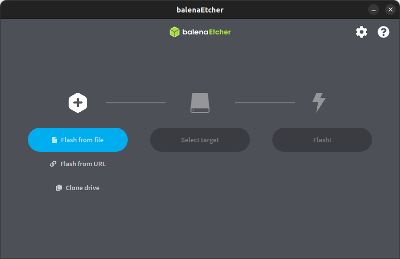
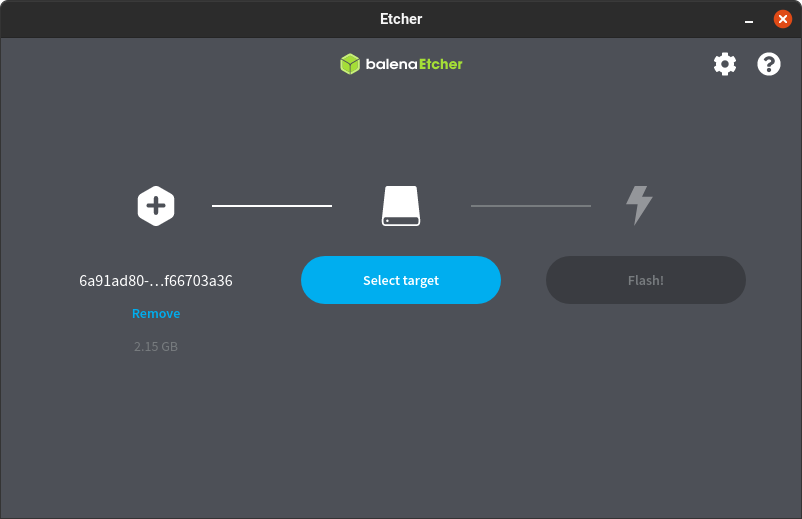
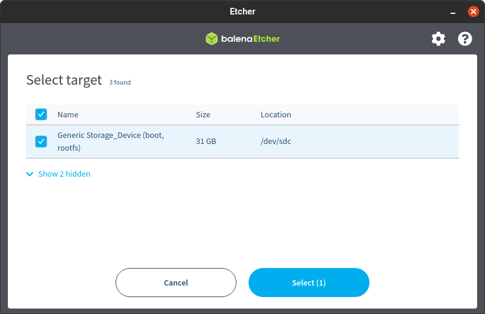
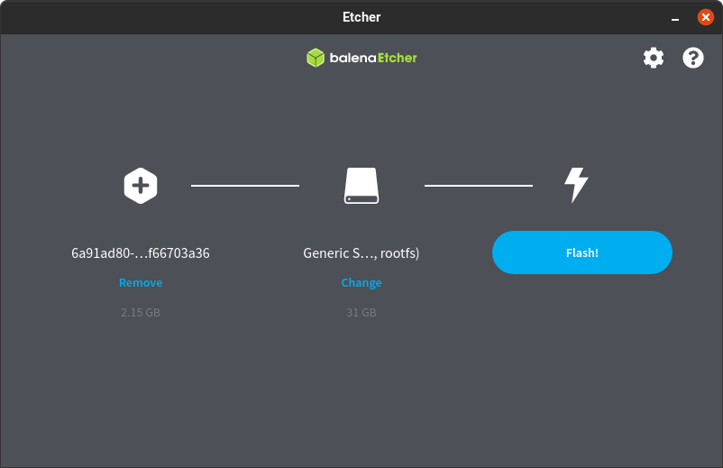
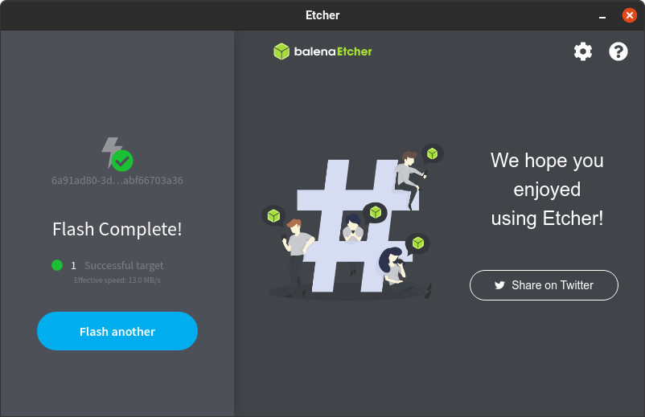
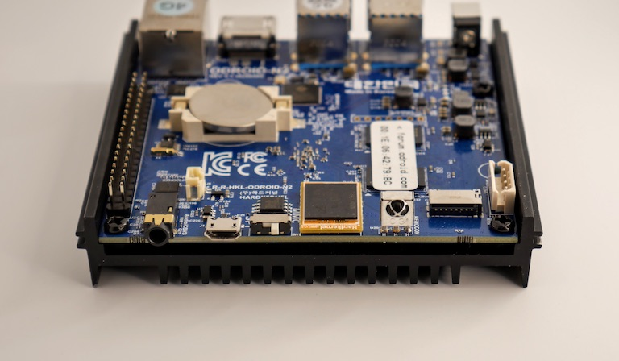
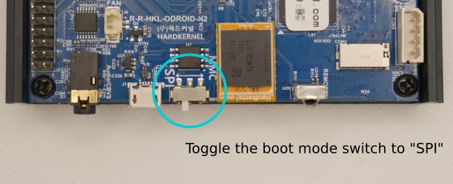
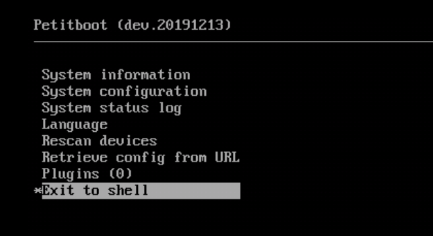

# odroid

## 安装 Home Assistant 操作系统

如果您想轻松开始使用 Home Assistant 或者几乎没有 Linux 经验，请按照本指南操作。

### 建议的硬件

开始安装 Home Assistant 需要准备一些东西。下面的链接指向 Ameridroid。如果您不在美国，应该可以在您所在国家的网店找到这些商品。

首先，我们建议使用 ODROID-N2+（这是我们的 Home Assistant Blue 使用的板子）或 ODROID-M1。

如果不可用，我们也推荐 ODROID-C4。

Home Assistant 套装（美国市场）：

这些套装都预装了 Home Assistant。

- [ODROID-N2+: 2 GB RAM / 16 GB eMMC](https://ameridroid.com/products/odroid-n2-home-assistant-blue-bundle-limited-edition?variant=44748729286935?ref=eeb6nfw07e)
- [ODROID-N2+: 4 GB RAM / 64 GB eMMC](https://ameridroid.com/products/odroid-n2-home-assistant-blue-bundle-limited-edition?variant=44748729221399?ref=eeb6nfw07e)
- ODROID-M1: 4 GB RAM / 256 GB NVMe / [16 GB µSD](https://ameridroid.com/products/odroid-n2-home-assistant-blue-bundle-limited-edition?variant=44929573028119?ref=eeb6nfw07e) 或 [16 GB eMMC](https://ameridroid.com/products/odroid-n2-home-assistant-blue-bundle-limited-edition?variant=44994940567831?ref=eeb6nfw07e)
- ODROID-M1: 8 GB RAM / 256 GB NVMe / [16 GB µSD](https://ameridroid.com/products/odroid-n2-home-assistant-blue-bundle-limited-edition?variant=44929573093655?ref=eeb6nfw07e) 或 [16 GB eMMC](https://ameridroid.com/products/odroid-n2-home-assistant-blue-bundle-limited-edition?variant=44994940633367?ref=eeb6nfw07e)
- [ODROID-M1: 8 GB RAM / 1 TB NVMe / 64 GB eMMC](https://ameridroid.com/products/odroid-n2-home-assistant-blue-bundle-limited-edition?variant=44994940698903?ref=eeb6nfw07e)

未预装 Home Assistant 的版本：

- ODROID-N2+, 2 GB RAM 或 4 GB RAM
- ODROID-C4
- ODROID-M1
- ODROID-M1S, 4 GB RAM 或 8 GB RAM
- 电源适配器
- CR2032 纽扣电池
- eMMC 模块
- 外壳

这些是联盟链接。我们通过此帖子中的链接获得购买佣金。

### 将镜像写入启动介质

1. 注意：此过程将把 Home Assistant 操作系统写入您的设备。
    - 这意味着您将丢失所有数据以及之前安装的操作系统。
    - 在继续下一步之前，请备份您的数据。
2. 将 Home Assistant 启动介质（eMMC 模块或 SD 卡）连接到您的计算机。

    如果您使用 ODROID-M1，请注意不支持从 NVMe 启动。如果您想从 eMMC 启动，请在安装镜像之前更新固件。

    如果您使用 Home Assistant Blue 或 ODROID-N2+，您可以直接连接设备。

    如果您使用 ODROID-M1S，您需要按照本指南将设备启动到 UMS 模式。

3. 下载并启动 Balena Etcher。在 Windows 上，您可能需要以管理员权限运行它。

4. 将镜像下载到您的计算机。

    - 复制镜像的 URL。
    - 如果下面有多个链接，请确保选择适合您 ODROID 版本的链接。

import { Tabs, TabsContent, TabsList, TabsTrigger } from "../../../src/components/ui/tabs"

<Tabs defaultValue="1">
  <TabsList>
    <TabsTrigger value="1">ODROID-N2</TabsTrigger>
    <TabsTrigger value="2">ODROID-N2+</TabsTrigger>
    <TabsTrigger value="3">ODROID-C2</TabsTrigger>
        <TabsTrigger value="4">ODROID-C4</TabsTrigger>
    <TabsTrigger value="5">ODROID-M1</TabsTrigger>
    <TabsTrigger value="6">ODROID-M1S</TabsTrigger>
  </TabsList>
  <TabsContent value="1">
  ```
https://github.com/home-assistant/operating-system/releases/download/15.1/haos_odroid-n2-15.1.img.xz
  ```
  </TabsContent>
  <TabsContent value="2">
  ```
https://github.com/home-assistant/operating-system/releases/download/15.1/haos_odroid-n2-15.1.img.xz
  ```
  </TabsContent>
  <TabsContent value="3">
  ```
https://github.com/home-assistant/operating-system/releases/download/15.1/haos_odroid-c2-15.1.img.xz
  ```
  </TabsContent>
    <TabsContent value="4">
  ```
https://github.com/home-assistant/operating-system/releases/download/15.1/haos_odroid-c4-15.1.img.xz
  ```
  </TabsContent>
  <TabsContent value="5">
  ```
https://github.com/home-assistant/operating-system/releases/download/15.1/haos_odroid-m1-15.1.img.xz
  ```
  </TabsContent>
  <TabsContent value="6">
  ```
https://github.com/home-assistant/operating-system/releases/download/15.1/haos_odroid-m1s-15.1.img.xz
  ```
  </TabsContent>
</Tabs>

选择并复制 URL 或使用悬停时出现的"复制"按钮。

1. 将 URL 粘贴到浏览器中开始下载。

2. 解压您刚刚下载的文件。

3. 选择"从文件烧录"并选择您刚刚解压的镜像。
    - 不要使用"从 URL 烧录"。在某些系统上不起作用。
        

        **选择目标。**
        
        选择您要用于安装的启动介质（eMMC 模块或 SD 卡）。
        
        选择"烧录！"开始写入镜像。
    - 如果操作失败，请解压 .xz 文件并重试。
        
    - 当 Balena Etcher 完成写入镜像后，您将看到确认信息。Etcher 软件显示安装完成的截图。
        

### 启动您的 ODROID
1. 插入您刚刚创建的启动介质（eMMC 模块或 SD 卡）。

2. 插入连接到网络和互联网的以太网电缆，并接通系统电源。

    - 注意：需要互联网，因为新安装的 Home Assistant OS 尚未包含所有 Home Assistant 组件。它会在首次启动时下载最新版本的 Home Assistant Core。

3. 在桌面系统的浏览器中，几分钟后您就可以通过 [homeassistant.local:8123](http://homeassistant.local:8123/) 访问您的新 Home Assistant。

:::note
如果您运行的是较旧版本的 Windows 或具有更严格的网络配置，您可能需要通过 homeassistant:8123 或 http://X.X.X.X:8123 访问 Home Assistant（将 X.X.X.X 替换为您的 ODROID 的 IP 地址）。
:::

安装并可以访问 Home Assistant 操作系统后，您可以继续进行初始化设置。

### 烧录 ODROID-N2+

Home Assistant 可以通过板子正面的 USB-OTG 连接直接连接到计算机来烧录到 ODROID-N2+。该设备包含 Petitboot 引导加载程序，它允许 ODROID-N2+ 存储显示为 USB 驱动器。

所有这些说明同样适用于 ODROID-N2（非 plus 版本）。

### 您需要什么

要使用 Petitboot 和 OTG-USB 烧录您的 eMMC，您需要以下物品：

- HDMI 电缆和显示器
- USB 键盘
- USB 2.0 转 micro-USB 电缆
- 如果您的板子来自 Home Assistant Blue：需要 No.2 六角扳手打开外壳

### 启用 SPI 启动模式

要启用 SPI 启动模式：

1. 通过拔掉电源线关闭 ODROID-N2+。

2. 移除外壳。
    

3. 找到启动模式开关，将其从 MMC 切换到 SPI。
    

4. 通过板子正面的 USB-OTG 端口将 ODROID-N2+ 直接连接到您的计算机。

5. 将 USB 键盘和显示器（使用 HDMI）连接到您的 ODROID-N2+。

6. 插入电源线为 ODROID-N2+ 供电。

### 启用 USB 驱动器模式

将 ODROID-N2+ 设置为 SPI 启动模式并通电后，它会启动到终端。要启用 USB 驱动器模式：

1. 从菜单中选择 `Exit to shell`。
    

:::note
使用命令行时，可能会返回以下消息：`can't access tty; job control turned off.` 您可以安全地忽略此消息并继续安装
:::

1. 在控制台使用以下命令确认存储设备节点：

```
ls /dev/mmc*
```

2. 使用 ums 命令（USB 大容量存储模式）将 ODROID-N2+ 上的存储设备设置为大容量存储设备。这将配置 ODROID-N2+ 和 OTG 作为存储卡读卡器：

```
ums /dev/mmcblk0
```

### 烧录 Home Assistant

1. 通过 ODROID-N2+ 正面的 micro-USB 端口将 ODROID-N2+ 连接到您的 PC。

2. 当 ODROID-N2 被识别为 USB 连接的存储设备时，您可以使用 Etcher 烧录 eMMC。
    - 使用 ODROID-N2+ 的最新稳定版 Home Assistant OS（haos_odroid-n2-15.1.img.xz）。
    - 在 Balena 中，使用"从文件烧录"。"从 URL 烧录"在所有系统上都不起作用。

3. 烧录过程完成后，断开 ODROID-N2+ 与 PC 的连接。
    - 移除电源线。
    - 移除 USB 和 HDMI 电缆。
    - 确保将启动模式开关切换回 MMC。

4. 将 ODROID 放回外壳中。

5. 使用以太网电缆将您的 ODROID-N2+ 连接到网络，确保可以访问互联网，然后接通电源。

6. 如果您的路由器支持 mDNS，您可以通过 `http://homeassistant.local:8123` 访问您的安装。

    - 如果您的网络不支持 mDNS，您将不得不使用 ODROID-N2+ 的 IP 地址而不是 `homeassistant.local`。例如，`http://192.168.0.9:8123`。
    - 您应该能够从路由器的管理界面找到您的 ODROID-N2+ 的 IP 地址。

7. 继续进行初始化设置。

### 烧录 ODROID-M1S

Home Assistant 可以通过板子正面的 USB-OTG 连接直接连接到计算机来烧录到 ODROID-M1S。与其他 ODROID 板子不同，M1S 没有用于可选 eMMC 模块的插槽。它也没有单独的闪存芯片来保存专用的引导加载程序。相反，M1S 有一个直接焊接到板子上的内置 64GB eMMC，默认情况下保存引导加载程序。本指南将向您展示如何将 Home Assistant 操作系统安装到内置 eMMC。

:::warning
安装 Home Assistant OS 会使用 Home Assistant OS 提供的主线版本替换 eMMC 上的固件和 SPL。因此，无法再使用带有 EMMC2UMS 镜像的 SD 卡，因为主线 SPL 目前（2024 年 2 月）与 EMMC2UMS 镜像中的 U-Boot 不兼容。这不会对标准使用造成任何问题，只是在您想返回到 Hardkernel 提供的 OS 时会使事情变得更复杂（请参阅 HK 恢复）。
:::

### 您需要什么

要使用 USB-OTG 烧录您的 eMMC，您需要以下物品：

- 一张小 SD 卡
- 另一台计算机
- USB 2.0 转 micro-USB 电缆
- 特殊的 Hardkernel eMMC-to-USB-mass-storage 镜像

### 启动到大容量存储模式

（这些步骤与官方 Hardkernel wiki 页面相同。）

1. 下载 ODROID-M1S_EMMC2UMS.img。

2. 使用 balena Etcher 或其他工具将 UMS 工具烧录到 SD 卡上。
    - 使用"从文件烧录"。"从 URL 烧录"在所有系统上都不起作用。（balena Etcher 会提示烧录过程中出现问题。您可以忽略此消息）

3. 将 SD 卡插入您的 ODROID-M1S 并启动它。

### 烧录 Home Assistant M1S

1. 下载 ODROID-M1S 的最新稳定版 Home Assistant OS。

2. 除了要烧录的 HAOS 镜像（M1S 而不是 N2+ 版本）之外，您可以按照 N2+ 的逐步烧录指南进行操作。

#### HK 恢复

如果您想将 M1S 恢复到 Hardkernel 的初始状态，您需要恢复 HK 的引导加载程序。重新烧录 eMMC 并选择您想要的操作系统的可靠方法是使用 Home Assistant OS 烧录 EMMC2UMS 镜像，这将使 ODROID-M1S 变成 USB 大容量存储设备。一旦您烧录了 EMMC2UMS 镜像，您就可以再次烧录任何操作系统。您需要一根 micro USB 电缆将 ODROID-M1S 连接到 PC。

:::note 
这些命令将使您当前的 Home Assistant OS 安装无法启动！
:::

使用本地终端（HDMI/键盘）访问系统控制台。在 Home Assistant CLI（命令行）上，输入 login 进入 root shell，并使用 curl 下载镜像并使用 dd 将其写入 eMMC 块设备：

```
curl https://dn.odroid.com/RK3566/ODROID-M1S/Installer/ODROID-M1S_EMMC2UMS.img | dd of=/dev/mmcblk0
```

这样，在下次启动时（移除 SD 卡后），设备将以 UMS 模式启动。按照"从 PC 通过 USB 安装"的步骤安装不同的操作系统。

## 安装 Home Assistant 容器

以下说明适用于在您自己管理的容器环境中运行的 Home Assistant 容器安装。可以使用任何 OCI 兼容的运行时，但本指南将重点介绍使用 Docker 进行安装。

:::note 
此安装方法无法使用附加组件。如果您想使用附加组件，需要使用其他安装方法。推荐的方法是 Home Assistant 操作系统。请查看安装类型的概述表以了解差异。
:::

:::tip important
**先决条件** 本指南假设您已经设置了操作系统并安装了容器运行时（如 Docker）。

如果您使用 Docker，则需要至少版本 19.03.9，最好是更高版本，以及 `libseccomp` 2.4.2 或更新版本。Docker Desktop 不起作用，您必须使用 Docker Engine。
:::

### 平台安装

使用 Docker 安装很简单。调整以下命令，使：

- `/PATH_TO_YOUR_CONFIG` 指向您要存储配置并运行它的文件夹。确保保留 `:/config` 部分。

- `MY_TIME_ZONE` 是 [tz 数据库名称](https://en.wikipedia.org/wiki/List_of_tz_database_time_zones)，如 `TZ=America/Los_Angeles`。

- D-Bus 是可选的，但如果您计划使用 [蓝牙集成](/docs/started/installation/bluetooth) 则是必需的。

<Tabs defaultValue="1">
  <TabsList>
    <TabsTrigger value="1">安装</TabsTrigger>
    <TabsTrigger value="2">更新</TabsTrigger>
  </TabsList>
  <TabsContent value="1">
```
docker run -d \
  --name homeassistant \
  --privileged \
  --restart=unless-stopped \
  -e TZ=MY_TIME_ZONE \
  -v /PATH_TO_YOUR_CONFIG:/config \
  -v /run/dbus:/run/dbus:ro \
  --network=host \
  ghcr.io/home-assistant/home-assistant:stable
```
  </TabsContent>
  <TabsContent value="2">
  ```
# 如果返回"Image is up to date"，那么您可以在此停止
docker pull ghcr.io/home-assistant/home-assistant:stable

# 停止正在运行的容器
docker stop homeassistant

# 从 Docker 的容器列表中移除它
docker rm homeassistant

# 最后，启动一个新的
docker run -d \
  --name homeassistant \
  --restart=unless-stopped \
  --privileged \
  -e TZ=MY_TIME_ZONE \
  -v /PATH_TO_YOUR_CONFIG:/config \
  -v /run/dbus:/run/dbus:ro \
  --network=host \
  ghcr.io/home-assistant/home-assistant:stable
  ```
  </TabsContent>
</Tabs>


