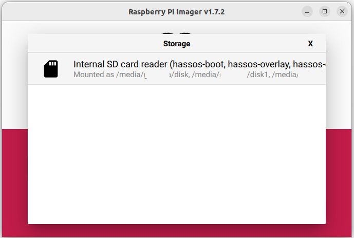

# 树莓派

## 硬件准备

在开始安装 Home Assistant 之前，我们需要准备以下硬件：

:::info 重要提醒
在购买硬件之前，请确保您了解所有必需的组件。不完整的硬件配置可能会导致安装失败或系统运行不稳定。
:::

- 树莓派 5 或树莓派 4（带电源）
  （树莓派 3B 也可以入门使用，但 Model A 型号内存不足）

- Micro SD 卡
    - 建议选择 A2 级别的存储卡。A2（Application Class 2）存储卡在小文件读写性能更好，更适合运行应用程序
    - 容量至少要有 32GB

- SD 卡读卡器
  大多数笔记本都自带读卡器，如果没有可以购买一个 USB 读卡器，选择最便宜的即可

- 网线
  安装时必需。虽然安装后可以使用 Wi-Fi，但为了稳定性，我们强烈建议使用有线网络

:::info 注意

请确保使用合适的电源适配器。手机充电器可能不合适，因为有些充电器只对特定品牌手机才能输出足够功率。电脑的 USB 接口供电也不足，切勿使用。

:::

## 安装 Home Assistant 操作系统

本教程将指导您使用树莓派镜像烧录工具（Raspberry Pi Imager）在树莓派上安装 Home Assistant 操作系统。

### 烧录系统镜像

1. 从 https://www.raspberrypi.com/software/ 下载并安装树莓派镜像烧录工具
    - **故障排除**：如果您的系统不支持树莓派镜像烧录工具，可以直接下载 Home Assistant 镜像，使用其他烧录工具（如 Balena Etcher）
2. 打开树莓派镜像烧录工具，选择您的树莓派型号
    
3. 选择操作系统：
    1. 点击**选择操作系统**
    2. 选择**其他专用系统 > Home Assistant 和家庭自动化 > Home Assistant**
    3. 选择与您硬件匹配的 Home Assistant 系统（RPi 3、RPi 4 或 RPi 5）
    

4. 选择存储：
    1. 将 SD 卡插入电脑（注意：卡内原有内容将被清除）
    2. 选择您的 SD 卡
        

5. 开始烧录：
    1. 点击"下一步"开始烧录
    2. 等待系统写入完成
        

6. 弹出 SD 卡

### 启动树莓派

1. 将烧录好的 SD 卡插入树莓派
2. 连接网线，确保树莓派与您的电脑在同一网络，且可以访问互联网
3. 接通电源，启动设备

### 访问 Home Assistant

接通电源几分钟后，您就可以访问全新的 Home Assistant 了。

- 在电脑浏览器中访问 [homeassistant.local:8123](http://homeassistant.local:8123/)

:::info 提示

如果您使用的是较旧的 Windows 系统或网络配置较为严格，可能需要通过 homeassistant:8123 或 http://X.X.X.X:8123 访问（将 X.X.X.X 替换为树莓派的 IP 地址）。

:::

- 页面加载时间取决于硬件性能。在树莓派 4 或 5 上，通常一分钟内就能访问
    - 如果 5 分钟后仍无法访问，可能是镜像烧录有问题
        - 尝试重新烧录，必要时更换 SD 卡
    - 如果问题仍然存在，查看树莓派的控制台输出
        - 通过 HDMI 接口连接显示器查看

恭喜！您已完成树莓派的安装设置！

### 手动下载 Home Assistant 镜像

如果无法使用树莓派镜像烧录工具，您可以手动下载镜像，使用其他工具（如 Balena Etcher）进行烧录。

根据您的树莓派型号，复制对应的下载链接（注意：下面有 3 个不同的链接！）：

import { Tabs, TabsContent, TabsList, TabsTrigger } from "../../../src/components/ui/tabs"

<Tabs defaultValue="5">
  <TabsList>
    <TabsTrigger value="5">树莓派 5</TabsTrigger>
    <TabsTrigger value="4">树莓派 4</TabsTrigger>
    <TabsTrigger value="3">树莓派 3</TabsTrigger>
  </TabsList>
  <TabsContent value="5">
  ```
    https://github.com/home-assistant/operating-system/releases/download/15.1/haos_rpi5-64-15.1.img.xz
  ```
  </TabsContent>
  <TabsContent value="4">
  ```
    https://github.com/home-assistant/operating-system/releases/download/15.1/haos_rpi4-64-15.1.img.xz
  ```
  </TabsContent>
  <TabsContent value="3">
  ```
    https://github.com/home-assistant/operating-system/releases/download/15.1/haos_rpi3-64-15.1.img.xz
  ```
  </TabsContent>
</Tabs>

完成 Home Assistant 操作系统的安装并确认可以访问后，您就可以继续进行初始化设置了。

