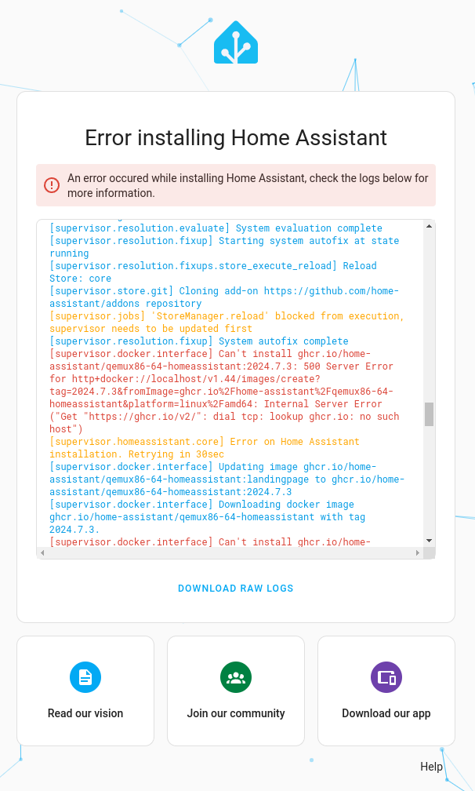

# 安装问题故障排除

在安装和初始化 Home Assistant 时，您可能会遇到问题。本页面旨在帮助您解决最常见的问题。

## 无法在浏览器中访问 Home Assistant

### 问题："无法访问此网站"

当尝试在浏览器中访问 Home Assistant 时，浏览器显示"无法访问此网站"的消息。

### 描述
这意味着浏览器无法在网络上找到您的 Home Assistant 安装。

### 解决方案
要解决此问题，请尝试以下步骤：

1. 确保您的 Home Assistant 设备已通电（LED 灯亮起）。
2. 确保您的 Home Assistant 安装已连接到互联网：
    - 确保以太网电缆已插入 Home Assistant 和路由器或交换机。
    - 确保您的网络可以访问互联网。
        - 在首次启动期间，时间将同步。确保您的网络允许 NTP。
        - 在首次启动期间，Home Assistant 会完成安装。它需要访问以下 URL：
            - version.home-assistant.io：获取新版本信息。
            - github.com：更新附加组件商店的元数据。
            - ghcr.io：GitHub 容器注册表，用于获取新的 Home Assistant 更新。
3. 确保您打开浏览器访问 Home Assistant 的系统与 Home Assistant 连接到同一网络。
    - 例如，如果运行浏览器的系统使用 Wi-Fi，请确保它使用与 Home Assistant 相同的 Wi-Fi。

4. 确保您输入的地址正确。
    - 特别是如果消息包含错误代码"ERR_CONNECTION_REFUSED"，很可能是 URL 的端口部分（`:8123`）有拼写错误。
    - 通常，URL 是 `http://homeassistant.local:8123`。
    - 如果您运行的是较旧版本的 Windows 或具有更严格的网络配置，请尝试使用 `http://homeassistant:8123`。

5. 系统可能仍在启动中。等待几分钟并刷新页面。
    - 刷新可能因浏览器而异。查找刷新图标，或按 `CTRL+R` 或 `CTRL+SHIFT+R`。

6. 检查路由器的 Web 界面，查看分配给您的 Home Assistant 安装的 IP 地址。
    - 直接在浏览器中输入此 IP 地址（`http://x.x.x.x:8123`）。

7. 如果仍然无法访问 Home Assistant，请将键盘和显示器连接到运行 Home Assistant 的设备以访问控制台并查看 Home Assistant 卡在哪里。
    - 如果您使用 Home Assistant Green，请按照[这些步骤访问控制台](https://green.home-assistant.io/guides/use-terminal/)。
    - 如果您使用 Home Assistant Yellow，请按照[这些步骤从 Windows 访问控制台](https://yellow.home-assistant.io/guides/use-serial-console-windows/)，或[从 Linux 或 macOS 访问控制台](https://yellow.home-assistant.io/guides/use-serial-console-linux-macos/)。

8. [向我们的社区寻求帮助](https://www.home-assistant.io/help/)

## "安装 Home Assistant 时出错"

### 问题：在初始化过程中出现"安装 Home Assistant 时出错"

您正在进行初始化过程，但收到**安装 Home Assistant 时出错**的消息。

### 解决方案
1. 确保您的网络可以访问互联网。
    - 在首次启动期间，时间将同步。确保您的网络允许 NTP。
    - 在首次启动期间，Home Assistant 会完成安装。它需要访问以下 URL：
        - version.home-assistant.io：获取新版本信息。
        - github.com：更新附加组件商店的元数据。
        - ghcr.io：GitHub 容器注册表，用于获取新的 Home Assistant 更新。
2. 更改网络环境后，等待几分钟。Home Assistant 将尝试重新连接。
3. [向我们的社区寻求帮助](https://www.home-assistant.io/help/)

## 卡在"准备 Home Assistant"阶段

### 问题：初始化过程似乎卡在"准备 Home Assistant"阶段
您正在进行初始化过程，但进程似乎卡在**准备 Home Assistant**步骤。

### 解决方案
1. 选择 pulsing blue dot 以查看日志文件。
    - 日志文件可能会提供有关当前状态的更多信息。

2. 确保您的网络可以访问互联网。
    - 在首次启动期间，时间将同步。确保您的网络允许 NTP。
    - 在首次启动期间，Home Assistant 会完成安装。它需要访问以下 URL：
        - version.home-assistant.io：获取新版本信息。
        - github.com：更新附加组件商店的元数据。
        - ghcr.io：GitHub 容器注册表，用于获取新的 Home Assistant 更新。
2. 更改网络环境后，等待几分钟。Home Assistant 将尝试重新连接。
3. [向我们的社区寻求帮助](https://www.home-assistant.io/help/)

